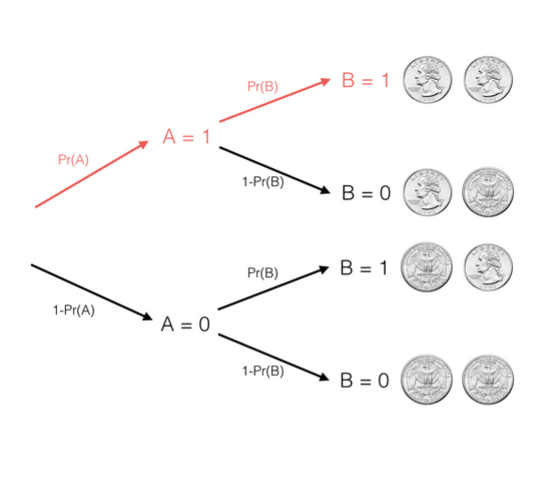
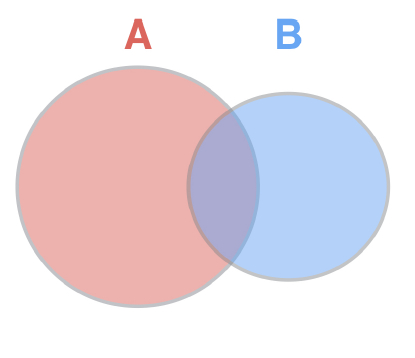
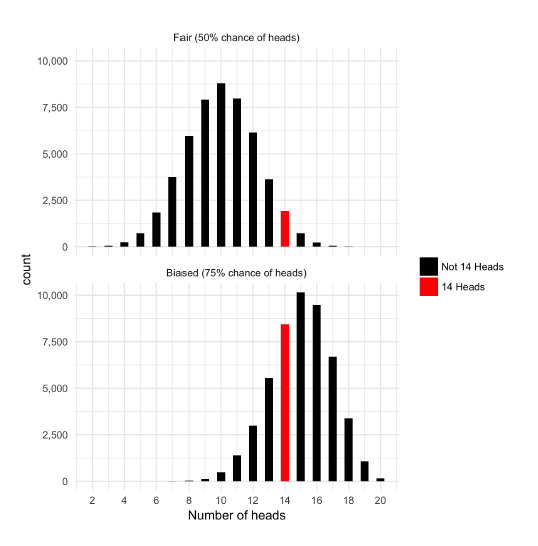
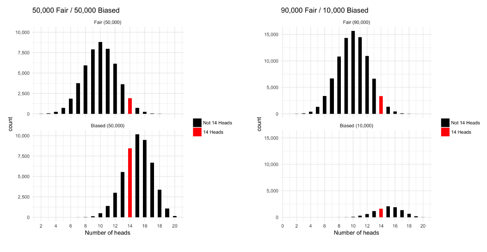
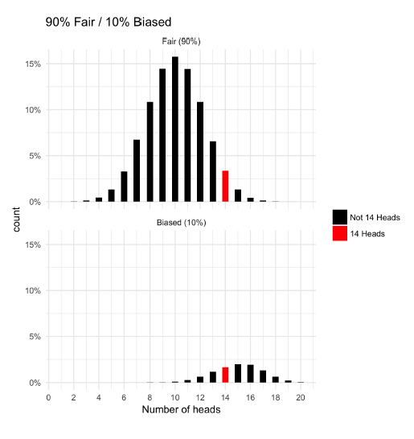

  
```{r setup}
knitr::opts_chunk$set(error = TRUE, 
                      collapse = TRUE, 
                      comment = "#>")
set.seed(10^7*4)
library(styler)
library(lintr)
library(purrr)
```

# Flipping coins in R

## Simulating coin flips

In these exercises, you'll practice using the `rbinom()` function, which generates random "flips" that are either 1 ("heads") or 0 ("tails").

```{r flipping_1_coin}
# Generate 10 separate random flips with probability .3
args(rbinom)
rbinom(n = 10, size = 1, p = 0.3)
```

`rbinom()` takes three arguments:

* `n` = number of observations i.e. the number of separate random flips
* `size` = number of trials i.e. number of coins
* `p` = probability of success on each trial. 

In this case of a coin flip, `p` is the probability that the coin returns head. Note: if a coin lands on head, we call that a successful trial. 

## Simulating draws from a binomial

In the last exercise, you simulated 10 separate coin flips, each with a 30% chance of heads. Thus, with `rbinom(10, 1, .3)` you ended up with 10 outcomes that were either 0 ("tails") or 1 ("heads").

But by changing the second argument of `rbinom()` (currently `1`), you can flip multiple coins within each draw. Thus, each outcome will end up being a number between *0 and 10*, showing the number of flips that were heads in that trial.

```{r flipping_10_coins}
# Generate 100 occurrences of flipping 10 coins, each with 30% probability
rbinom(n = 100, size = 10, p = 0.3)
```

# Density and cumulative density

When you flip a fair coin 10 times, what's the most likely number of heads? Well, since heads or tails are equally likely, you can probably figure out that the most likely outcome is 5 heads and 5 tails. Say, I offer you a bet if it exactly that result I will pay you a dollar(\$) otherwise you'll pay me a dollar. Should you take the bet? To answer this, we'll have to find out the probability of a binomial random variable `X` with those parameters: 10 flips with a probability of 0.5.

$$X  \sim \textrm{Binomial(10, .5)} $$ 

results in a outcome of 5 which can be expressed as :

$$Pr (X = 5)$$

One way to find out is to simulate many draws from X, say 1000000 and then see how common each outcome is. We can use a neat trick in R to calculate the fraction equal to 5 directly. The expression `flips == 5` compares each item in the vector to 5, we can then use the `mean()` function to find the fraction of comparisons that are `TRUE`. This works because the `mean()` function treats TRUE as 1 and FALSE as 0. Thus, `mean(flips == 5)` gives the fraction of values equals to 5. You're going to be using this trick with mean a lot in the exercises whenever you estimate values with simulation. In this case we found that the fraction of outcomes equals 5 is 0.2450 i.e. there is a 24.5% chance---this is called the density of the binomial at that point. 

```{r plotting_flips, message=FALSE}
# learnr::run_tutorial("introduction", package = "ggformula")
set.seed(10^7*4)
library(ggformula)
flips <- rbinom(100000, 10, .5)
mean(flips == 5) 
gf_histogram( ~ flips, bins = 10, 
              color = "orange", 
              fill = "navy blue", 
              xlab = "Number of heads") + ggtitle("Histogram of simulation: 100000 obs & 10 trials & p = 0.5")
```

Simulation is a very useful to understand a distribution and to answer questions about its behavior. But, in the case of the binomial distribution, R also provides a way to calculate the exact probability density using the `dbinom()` function.

```{r}
dbinom(5, 10, .5)
```

`dbinom()` takes three arguments:

* `d` = the outcome we are estimating the density at, 5. 
* `size` = number of coins, 10
* `p` = probability of each being heads, 0.5. 

Notice, that this gives the result of 0.246. This confirms the result from our simulation of the probability. Similarly, we could calculate the probability density of getting exactly 6 heads or all 10 being heads by changing the first argument. Find the probability through both simulation and exact calculation will be a common task in this course. 

```{r}
dbinom(6, 10, .5)
dbinom(10, 10, .5)
```

So, now you know not to take my bet. More likely than not, we won't exactly 5 heads set of 10. What if I offer you a new bet: I'll pay you a \$ if 4 or fewer come up heads otherwise you have to pay me. 

$$X  \sim \textrm{Binomial(10, .5)} $$ 

results in a outcome equal to or less than 4 which can be expressed as:

$$Pr (X \le 5)$$

This describes the cumulative density of the binomial. The process of calculating the cumulative density is similar to process of calculating the density. You can estimate it using simulation. We generate an 100000 draws from the binomial distribution then instead of using `==` we do `mean(flips <= 4)`. 

```{r}
mean(flips <= 4)
```

You can see that this was true for about 37.8% of the simulations. Much like the density, R provides function to get the exactly cumulatve density of the binomial. Rather than `dbinom()` you use `pbinom()`. 

```{r}
pbinom(4, 10, 0.5)
```

This results confirms the probability is about 37.7% that a binomial with 10 flips gets 4 or fewer heads. In other words, you shouldn't stil take my bet. 

## Calculating density of a binomial

If you flip 10 coins each with a 30% probability of coming up heads, what is the probability exactly 2 of them are heads?

```{r}
# Calculate the probability that 2 are heads using dbinom
dbinom(2, 10, 0.3)

# Confirm your answer with a simulation using rbinom
mean(rbinom(10000, 10, 0.3) == 2)
```

## Calculating cumulative density of a binomial

If you flip ten coins that each have a 30% probability of heads, what is the probability at least five are heads?

```{r}
# Calculate the probability that at least five coins are heads
1 - pbinom(4, 10, 0.3)

# Confirm your answer with a simulation of 10,000 trials
mean(rbinom(10000, 10, 0.3) >= 5)
```

## Varying the number of trials

In the last exercise you tried flipping ten coins with a 30% probability of heads to find the probability at least five are heads. You found that the exact answer was `1 - pbinom(4, 10, .3)` = 0.1502683, then confirmed with 10,000 simulated trials.

Did you need all 10,000 trials to get an accurate answer? Would your answer have been more accurate with more trials?

```{r}
# Here is how you computed the answer in the last problem
# mean(rbinom(10000, 10, .3) >= 5)

# Try now with 100, 1000, 10,000, and 100,000 trials
mean(rbinom(100, 10, .3) >= 5)
mean(rbinom(1000, 10, .3) >= 5)
mean(rbinom(10000, 10, .3) >= 5)
mean(rbinom(100000, 10, .3) >= 5)
```

# Expected value and variance

## Expected value

When we talk about a probability distribution we are often interested in summarizing it into a few descriptive statistics. Two of the most interesting properties of a distribution are where the distribution is centered and how widely spread out it is. We describe this with the *expected value* and the *variance*. The expected value is the mean of the distribution. If you imagine we drew an infinite number of values in the distribution, the expected value is what the average of all those will be. This puts it right in the center of the distribution. 

Let's try to find the expected value of the binomial distribution with `size` (10) and `p` (0.5). We can't draw an infinite number of values, but we can draw a lot of them. We can use `rbinom()` to simulate 100000 draws with size (10) and p (0.5). Then use the `mean()` function to take the average of those draws. We see the average as very close to 5. That's the center of the distribution. 

```{r}
mean(flips)
```

$$X  \sim \textrm{Binomial(size, p)} $$ 

If we try to sample with a size of 100 and p of 0.2, we find that the mean is very close to 20. As you might noticed from these examples, there is a general rule. You can get the expected value of a binomial distribution by multiplying size i.e. the number of flips with p i.e. the probability each is heads:

$$\textrm{E[X] = size . p} $$ 

```{r}
mean(rbinom(100000, 100, 0.2))
```

## Variance

The expected value measures the center of the distribution, but we also want to measure how spread out the results are. Statisticians use the *variance* to measure this. Variance is the average^2^ distance of each value from the mean of the sample. The variance isn't quite as intutive as the mean, but it has useful mathematical properties that will become clear in this course. `R` provides the `var()` function to calculate variance froma particular sample. So we can simulate a 100000 draws of a binomial distribution with size (10) and p (0.5). Then use `var()` to find the variance of that distribution. We that the variance is very close to 2.5. Note: that the mean of this distribution is 5. That means 2.5 is the average^2^ distance between 5 and 1 random draw. 

```{r}
var(rbinom(100000, 10, 0.5))
```

The variance of a binomial distribution follows a particular general rule:

$$Var(X) = \textrm{size . }  p(1 - p) $$ 

So, for example the variance with the binomial parameters of 10 and 0.5 is:

$$Var(X) = \textrm{10 . }  0.5(1 - 0.5) = 2.5$$ 

This is exactly what we saw in the simulation. We could try this with another binomial distribution with size (100) and p(0.2). 

$$Var(X) = \textrm{100 . }  0.2(1 - 0.2) = 16$$ 

```{r}
var(rbinom(100000, 100, 0.2))
```

Just like the expected value, simulation gives us a way to estimate properties of a distribution by drawing many values while mathematical rules can also give you an exact answer. 

We thus have two rules for the properties of a binomial distribution:

1. The expected value of a binomial distribution is $\textrm{E[X] = size . p} $
2. The variance of the binomial distribution is $\textrm{Var(X) = size . p(1 - p)} $

## Calculating the expected value

What is the expected value of a binomial distribution where 25 coins are flipped, each having a 30% chance of heads?

```{r}
# Calculate the expected value using the exact formula
25 * 0.3

# Confirm with a simulation using rbinom
mean(rbinom(10000, 25, 0.3))
```

## Calculating the variance

```{r}
# Calculate the variance using the exact formula
25 * 0.3 * (1 - 0.3)

# Confirm with a simulation using rbinom
var(rbinom(10000, 25, 0.3))
```

# Laws of probability

## Probability of event A and event B

So far we've been using coin flips as a simple example of random phenomena, but let's step back from that and talk about what a coin flip represents: a random variable that is either yes or no. For example we can say:

* A represents a coin is heads. A either happens (A = 1) or it doesn't (A = 0)
* B represents a coin is tails

Note: Throughout this chapter we'll use events and coin flips interchangeably. We could say A is an event with a probability of 20% or A is a coin with 20% probability of being heads. 

In reality these events could represent a probability that it snowing outside or a probability someone will click an advertisement on a website. In this chapter we'll learn some of the mathematical laws that govern these kinds of random events and let us make predictions about them. 

Now, let's consider if you've two events: A and B. 

* Event A is the result of one flip (either 1 for heads and 0 for tails each with some probability). 
* Event B is the result of a second flip. 

Now, suppose you want to know the probability of A and B i.e. the probability that both flips are heads.  

Consider this in terms of nested branching. First, you flip coin A with some probability that it results in heads and some probability that it results in tails. This branches into two possibilities: A = 1 or A = 0. Second, you flip coin B, this causes both events to branch again separately. Only that one branch where A and B resulted in 1 (or heads) counts as A and B. We represent that by multiplying those two probabilities to represent the probability of using one branch after the other. 

> The probability of A and B is the probability of A times the probability of B. 

Note that this is true only if events A and B appear independent i.e. if the result of A doesn't affect the probability of B. This is generally true of two different coin flips and of all the cases we'll examine in this chapter. 

Two events A and B are independent if

$$\textrm{P(A and B)} = P(A) \cdot P(B)$$

and we write $A \amalg B$. A set of events $A_i : i \in I$ is independent if

$$P\Bigg(\displaystyle\bigcap_{i \in J}A_i\Bigg) = \prod_{i \in J}P(A_i)$$  

for every finite subset J of _I_. if A and B are not independent, we write

$$A \not\!\perp\!\!\!\perp B$$

## Simulating two coins

To confirm this, let's try a simulation of many coin flips. 

```{r}
A <- rbinom(100000, 1, 0.5)
```

Notice that we've set the parameters so that each draw has only one flip and each flip has a 50% chance of been heads. We can then simulate a 100000 flips of coin B seperately.

```{r}
B <- rbinom(100000, 1, 0.5)
```

Once, we have all the flips we can then compare all the pairs of them. `R` let's us compare them with the `&` operator and results in `TRUE` *if and only if* both A and B are 1. We thus get a sequence of TRUEs and FALSEs for each of the 100000 pairs. Once, we have this we can take the mean to find out the percentage that are TRUE just as we did in the simulations in the last chapter. 

```{r}
mean(A & B)
```

In this case, we see that A and B were both TRUE in about 25% of the simulations. This is the probability that two fair coins will bth result in heads. This confirms our rule:

$$\textrm{P(A and B)} = P(A) \cdot P(B)$$

OR

$$\textrm{P(A and B)} = 0.5 \cdot 0.5 = 0.25$$

We could the same simulation approach if the coin weren't fair i.e. if A and B do not have the same probability. For example, we can set event A to have a 10% probability and event B to have a 70% probability by setting the third argument of `rbinom()` to 0.1 and 0.7 respectively. When we then combine A and B, we see that about 7% of the pairs are both TRUE. 

```{r}
A <- rbinom(100000, 1, 0.1)
B <- rbinom(100000, 1, 0.7)
mean(A & B)
```

This again matches what we'll expect: The probability of 

$$\textrm{P(A and B)} = 0.1 \cdot 0.7 = 0.07$$

## Simulating the probability of A and B

```{r}
# Simulate 100,000 flips of a coin with a 40% chance of heads
A <- rbinom(100000, 1, 0.4)

# Simulate 100,000 flips of a coin with a 20% chance of heads
B <- rbinom(100000, 1, 0.2)

# Estimate the probability both A and B are heads
mean(A & B)
```

## Simulating the probability of A, B, and C

```{r}
# You've already simulated 100,000 flips of coins A and B
A <- rbinom(100000, 1, .4)
B <- rbinom(100000, 1, .2)

# Simulate 100,000 flips of coin C (70% chance of heads)
C <- rbinom(100000, 1, .7)

# Estimate the probability A, B, and C are all heads
mean(A & B & C)
```

## Probability of A or B

Suppose we flip a coin twice, what is the probability that *at least one* of the flips is heads? You can imagine this as two overlapping circles in a venn diagram? One circle represents whether event A happened such as the first flip being heads and one whether B happens such as the second flip being heads. The probability that either happens is the total region. 

To find that overall probability you could start by adding up the areas of the two circles but then you'll be double the region they overlap so you have to substract that as well. This means:

$$P\textrm{(A or B)} = P(A) + P(B) - P\textrm{(A and B)}$$

In the last lesson you learned that as long as the event are independent 

$$P\textrm{(A or B)} = P(A) + P(B) - P(A) \cdot P(B)$$

So, if A and B are independent flips of a fair coin we can take the probability of the first being heads (50%) plus the probability of the second being heads (50%) and then substract that from the probability they both are heads. 

$$P\textrm{(A or B)} = .5 + .5 - .5 \cdot .5 = .75$$

Let's try this in a simulation

```{r}
A <- rbinom(100000, 1, .5)
B <- rbinom(100000, 1, .5)
mean(A | B)
```

Here you can see the number is about 75%; this matches the number we earlier got from our rule. This also works if our coins are biased. 

```{r}
A <- rbinom(100000, 1, .2)
B <- rbinom(100000, 1, .6)
mean(A | B)
```

We can get the same answer using the rule:

$$P\textrm{(A or B)} = .2 + .6 - .2 \cdot .6 = .68$$

One advantage of simulation approach is that it extends the cases where mathematical solutions will get cumbersome. For example, what if we have three coins, A, B, and C and we want to know the probability that any of the three of them is heads i.e. $P\textrm{(A or B or C}$. The formular for three events is a bit complicated and you don't need to memorize it. 

$$P\textrm{(A or B or C)} = P(A) + P(B) + P(C) - P\textrm{(A and B)} \\ - P\textrm{(A and C)} - P\textrm{(B and C)} \\+ P\textrm{(A and B and C)} $$

But if you simulate the events A, B, and C, you can simply combine all of them using the `mean()` function with the `|` (logical OR) operator. You can do this even with 4 or 5 events. 

## Solving for probability of A or B

$$P\textrm{(A or B)} = .6 + .1 - .6 \cdot .1 = .64$$

## Simulating probability of A or B

```{r}
# Simulate 100,000 flips of a coin with a 60% chance of heads
A <- rbinom(100000, 1, .6)

# Simulate 100,000 flips of a coin with a 10% chance of heads
B <- rbinom(100000, 1, .1)

# Estimate the probability either A or B is heads
mean(A | B)
```

## Probability either variable is less than or equal to 4

Suppose X is a random Binom(10, .6) variable (10 flips of a coin with 60% chance of heads) and Y is a random Binom(10, .7) variable (10 flips of a coin with a 70% chance of heads), and they are independent.

What is the probability that either of the variables is less than or equal to 4?

```{r}
# Use rbinom to simulate 100,000 draws from each of X and Y
X <- rbinom(100000, 10, .6)
Y <- rbinom(100000, 10, .7)

# Estimate the probability either X or Y is <= to 4
mean(X <= 4 | Y <= 4)

# Use pbinom to calculate the probabilities separately
prob_X_less <- pbinom(4, 10, .6)
prob_Y_less <- pbinom(4, 10, .7)

# Combine these to calculate the exact probability either <= 4
prob_X_less + prob_Y_less - prob_X_less * prob_Y_less
```

## Multiplying random variables

Imagine I flip this fair coin 10 times and count the number of heads, then I take that number and triple it. What could you tell me about the resulting number? You don't exactly what it is but could you tell me its mean or its variance? Just like there are laws of probability for combining events. There are laws for manipulating random variables. In these next lessons, we'll learn to multiply random variables with a constant or combine them together. 

Suppose X is a random variable containing the result of flipping a fair coin 10 times, we could take draws from X. One draw could be 5 another could be 7 and yet another could be 4---each representing 10 flips of a coin. In probability it is important to get into the habit of manipulating random variables kind of if they are like algebraic symbols. 

$$X \sim \texttt{Binomial}(10, .5)$$

So, we could imagine defining a new random variable Y, which is 3 times X. If X were 5, Y will be 15, and if X were 7, Y will be 21. 

$$ Y \sim 3 \cdot X$$

Now, we want to know the properties of Y such as its expected value and variance. To do that imagine a histogram of X and compare it to a histogram of X * 3 = Y. Notice that the shape of Y is the same, but it is larger and more spread out. So, we'll expect both the expected value and variance to increase. 

Let's see what the exact effect of multiplying by 3 is through simulation. Try taking 100000 draws from X---a binomial with 10 flips of a fair coin. We can take the mean and check that the expect value is about 5 i.e. 10 flips multiplied by the probability of 0.5. 

```{r}
X <- rbinom(100000, 10, 0.5)
mean(X)
```

To get a sample from Y, we multiply our sample of X by 3. Note: 3 * X will multiply every individual value by 3. So we went from a 100000 draws from X to a 100000 draws from Y. We can find the expected value of Y by taking the `mean()` and we see that it is about 15. Thus, when we multiply a random variable by 3 we also multiply the expected value by 3. This makes sense because we can see that the distribution has roughly the same shape, it's just three times larger. This is a general rule. When you multiply a random variable by a constant _k_, you also multiply the expected value by _k_. 

```{r}
Y <- 3 * X
mean(Y)
```

We can also examine what happens to the variance. The variance of X is about 2.5. Recall that variance is size * p * 1 - p. Now, when we multiply it by 3 to get Y, the variance is about 22.5. It increase by a factor of 9. Why is it 9 because that's 3^2^.

```{r}
var(X)
var(Y)
```

Variance is the average square distance of values from the mean. So, when the distribution became three times wider, the variance increases by 9. This gives two general rules for the properties of random variables when they are multiplied by a constant. 

$$E[k \cdot Y] = k \cdot E[X] \\ \textrm{Var}[k \cdot X] = k^2 \cdot \textrm{Var}[X]$$ 

You are learning about the application of these rules with respect to a binomial distribution, but these holds regardless of what the distribution the random variables follows. So, they are useful in many applications of probability.  

## Simulating multiplying a random variable

```{r}
# Simulate 100,000 draws of a binomial with size 20 and p = .1
X <- rbinom(100000, 20, .1)

# Estimate the expected value of X
mean(X)

# Estimate the expected value of 5 * X
mean (5 * X)
```

## Variance of a multiplied random variable

In the last exercise you simulated X from a binomial with size 20 and p = .1 and now you'll use this same simulation to explore the variance.

```{r}
# X is simulated from 100,000 draws of a binomial with size 20 and p = .1
X <- rbinom(100000, 20, .1)

# Estimate the variance of X
var(X)

# Estimate the variance of 5 * X
var(5 * X)
```

## Adding two random variables together

In the last lesson you learned how to multiply a variable by a constant. Now, you will learn how to add multiple random variables together. Suppose we define two random variables, X and Y. X is the result of flipping 10 coins with each having a probability of heads of .5. Y is the result of flipping 100 coins with each coin having a probability of heads of .2. Assume these are two independent random variables i.e. you flip the coins separately. Now suppose we add those two random variables together to get a random variable Z. If we get 6 heads in X and 22 in Y then Z will be equal to 28. 

$$X \sim \texttt{Binomial}(10, .5) \\ Y \sim \textrm{Binomial}(100, .2) \\ Z \sim X + Y$$

```{r}
X <- rbinom(100000, 10, .5); mean(X)
Y <- rbinom(100000, 100, .2); mean(Y)
Z <- X + Y; mean(Z)

gf_histogram( ~ X, bins = 10, 
              color = "orange", 
              fill = "navy blue", 
              xlab = "X")
gf_histogram( ~ Y, bins = 20, 
              color = "orange", 
              fill = "navy blue", 
              xlab = "Y")
gf_histogram( ~ Z, bins = 40, 
              color = "orange", 
              fill = "navy blue", 
              xlab = "Z = X + Y")
```

Notice that Z is larger and more spread out than X and Y. While the distribution looks somewhat similar to X and Y, Z doesn't follow a binomial distribution, but we can stll make some predictions about its properties. We can simulate Z to find out its properties. Notice that the expected value of X, Y, and Z is about 5, 20, and 25. This is a general rule: The expected value of X + Y is the expected value of X plus the expected value of Y. 

$$E[X + Y] = E[X] + E[Y] $$

What about the variance of Z? We see in the histogram that it is more spread out that either X or Y. 

```{r}
X <- rbinom(100000, 10, .5); var(X)
Y <- rbinom(100000, 100, .2); var(Y)
Z <- X + Y; var(Z)
```

Notice that the variance of X, Y, and Z is about 2.5, 16, and 18.5 respectively. This also follows a general rule: the variance of the sum of two independent random variables is the sum of their variances. 

$$Var[X + Y] = Var[X] + Var[Y] $$

The rule for the addition of the expected values of two random events still holds even if the events are not independent i.e. even if the outcome of one influences the outcome of the probabilities of the other. However, the rule for adding the variances is true _if only if_ the probability of each events are independent of each other.

```{r}
# Simulate 100,000 draws of X (size 20, p = .3) and Y (size 40, p = .1)
X <- rbinom(100000, 20, .3)
Y <- rbinom(100000, 40, .1)

# Estimate the expected value of X + Y
mean(X + Y)
```

```{r}
# Simulation from last exercise of 100,000 draws from X and Y
X <- rbinom(100000, 20, .3) 
Y <- rbinom(100000, 40, .1)

# Find the variance of X + Y
var(X + Y)

# Find the variance of 3 * X + Y
var(3 * X + Y)
```

> Great simulating! Remember this rule only works when X and Y are independent.

# Bayesian Statistics

Throughout this course we've been talking about biased coins---coins that have a probability of heads that isn't 50%. That knowledge is going to come in handy because I'm worried I could have a biased coin here. My friend Nick and I made a bet on this coin: heads I pay him; tails he pays me. It's Nick's coin though and I am not sure I trust him, because I think he might have given me a trick coin that comes up heads 75% of the the time. How can we tell whether this coin is fair or biased? Well, we can run an experiment. Suppose, we flipped a coin 20 times and we see 14 heads and 6 tails. Now, that we've seen that. Do we believe the coin is fair or biased and could we give a probability. We are describing the process of *updating our beliefs after seeing evidence*, which is that heart of **Bayesian statistics**. 

In this chapter we'll talk about Bayesian statistics in terms of determining whether the coin is fair or biased based on evidence. Let's imagine that before we ran the experiment we think that there is a chance this coin is fair and 50% it's biased. Picture that as two piles of coins---one of 50,000 fair coins and one of 50,000 biased coins. Imagine that you took every coin from each of the two piles flipped it 20 times and recorded the results. You would get two histograms like this  

One for the fair coins and one for the biased coins.

Here is the trick of Bayesian statistics: When we see 14 heads out of 20 and we know whether it's either a fair or biased coin, we know that we are in one of those red bars in the histogram, all we need to know is which. Let's run this as a simulation.  

1. Go to every coin in the 50,000 fair coin flips it 20 times and record the number of heads. Then, we find out how many were 14s. There were nearly 2000 coins that resulted in 14 heads so it is possible to get that from a fair coin.

```{r}
fair <- rbinom(50000, 20, .5)
sum(fair == 14)
```

```{r}
# gf_histogram( ~ fair) + stat_identity(aes(sum(fair == 14)), position = "identity")
```


2. We do the same to see how many biased coins produce 14 heads. Notice that this time we changed the probability to `.75`. The original were of equal size but a lot more of the biased coin is ending up resulting in 14 heads. Notice that the red box is a lot taller in the biased histogram than the fair histogram and we can add them to see that between the two piles there were a total of 10,334 that resulted in 14 heads i.e. the total of the two red bars. 

```{r}
biased <- rbinom(50000, 20, .75)
sum(biased == 14)
```

```{r}
1898 + 8436

8436 / 10334
```

Now, we can get the conditional probability using the formular below: 

$$
\text{P(Biased | 14 Heads)} =\\ \frac{\texttt{# biased w/ 14 heads}}{\texttt{# total w/ 14 heads}} \\ = \frac{\texttt{8436}}{\texttt{1898 + 8436}} = \texttt{82%}
$$

We previously thought that there was a 50% chance that the coin was biased i.e. the piles were of equal size, but conditional on seeing 14 heads that probability has been updated to 82%. If we had seen 9 heads out of 20, which is more likely to come from a fair coin than a biased coin, the probability would have been updated in the opposite direction.

## Updating

Suppose you have a coin that is equally likely to be fair (50% heads) or biased (75% heads). You then flip the coin 20 times and see 11 heads.

Without doing any math, which do you now think is more likely- that the coin is fair, or that the coin is biased?

* Answer: More likely that the coin is fair

## Updating with simulation

We see 11 out of 20 flips from a coin that is either fair (50% chance of heads) or biased (75% chance of heads). How likely is it that the coin is fair? Answer this by simulating 50,000 fair coins and 50,000 biased coins.

```{r}
# Simulate 50000 cases of flipping 20 coins from fair and from biased
fair <- rbinom(50000, 20, .5)
biased <- rbinom(50000, 20, .75)

# How many fair cases, and how many biased, led to exactly 11 heads?
fair_11 <- sum(fair == 11)
biased_11 <- sum(biased == 11)

# Find the fraction of fair coins that are 11 out of all coins that were 11
fair_11 / (fair_11 + biased_11)
```

## Updating after 16 heads

Suppose that when you flip a different coin (that could either be fair or biased) 20 times, you see 16 heads.

Without doing any math, which do you now think is more likely- that this coin is fair, or that it's biased?

* Answer: More likely that the coin is biased.

## Updating with simulation after 16 heads

We see 16 out of 20 flips from a coin that is either fair (50% chance of heads) or biased (75% chance of heads). How likely is it that the coin is fair?

```{r}
# Simulate 50000 cases of flipping 20 coins from fair and from biased
fair <- rbinom(50000, 20, .5)
biased <- rbinom(50000, 20, .75)

# How many fair cases, and how many biased, led to exactly 16 heads?
fair_16 <- sum(fair == 16)
biased_16 <- sum(biased == 16)

# Find the fraction of fair coins that are 16 out of all coins that were 16
fair_16 / (fair_16 + biased_16)
```

## Prior probability

In these exercises, we've been determining whether a coin we got from Nick is fair or biased. We've treated as if before we saw any flips there is a 50% chance the coin is fair and a 50% chance the coin is biased towards heads. But let's say I generally trust Nick when he gave me a coin, I figured he wasn't really trying to trick me, I am just testing the coin to be completely safe. Let's say that when Nick gave me the coin I thought there was only a 10% chance it is biased and a 90% chance it is fair. This is called the **prior probability** and it is an important part of Bayesian statistics. 

Let's go back to the two piles of coins from the last lesson. One of the piles is fair and one them is biased and we flip everyone of them 20 times. We know that Nick got his coins from one of these two piles and by comparing the sizes of these red bars---the cases where the coin resulted in exactly 14 heads---we were able to find the conditiona probability. However, this time instead of having two equally size piles, let's start with 90,000 coins in the fair pile and only 10,000 biased coins in the biased pile. This represents our prior probability given the fair coins an advantage. Notice that in the resulting histograms the relative height of the red bars i.e. those with heads has changed. In fact even though each of the fair coin individually was less likely to result in 14 heads than a biased coin was there were more fair coins that ended up with 14 heads than biased ones. 



We can simulate these piles to find the conditional probability that a coin with 14 heads given our prior probability of 10%. We first simulate 90,000 draws from a binomial distribution where the coins are fair. Notice that we changed the first argument (the number of draws to 90,000). We see that 3,645 of these draws resulted in 14 heads. 

```{r}
fair <- rbinom(90000, 20, .5)
sum(fair == 14)
```

We then simulate only 10,000 draws from the biased coins each with a 75% chance of heads. We see that 1,703 of these resulted in 14 heads. 

```{r}
biased <- rbinom(10000, 20, .75)
sum(biased == 14)
```

Now, we can find out conditional probability given that we are using one of those coins that resulted in 14 heads, what fraction of those were biased? 33% of them were biased. We originally thought there was a 10% chance the coin was biased but after seeing 14 heads out of 20 flips, our probability has updated to 33%.  

```{r}
1703 / (3465 + 1703)
```

This simulation approach works even if there are more than two possibilities for the probability of heads. For example, you can start with three piles of coins---one that has a 25% chance; one that has a 50% chance; and another with 75% chance. 

## Updating with priors

We see 14 out of 20 flips are heads, and start with a 80% chance the coin is fair and a 20% chance it is biased to 75%.

You'll solve this case with simulation, by starting with a "bucket" of 10,000 coins, where 8,000 are fair and 2,000 are biased, and flipping each of them 20 times.

```{r}
# Simulate 8000 cases of flipping a fair coin, and 2000 of a biased coin
fair_flips <- rbinom(8000, 20, .5)
biased_flips <- rbinom(2000, 20, .75)

# Find the number of cases from each coin that resulted in 14/20
fair_14 <- sum(fair_flips == 14)
biased_14 <- sum(biased_flips == 14)

# Use these to estimate the posterior probability
fair_14 / (fair_14 + biased_14)
```

Awesome! How did adding a prior into the mix change your outcome? 

## Updating with three coins

Suppose instead of a coin being either fair or biased, there are three possibilities: that the coin is fair (50% heads), low (25% heads), and high (75% heads). There is a 80% chance it is fair, a 10% chance it is biased low, and a 10% chance it is biased high.

```{r}
# Simulate 80,000 draws from fair coin, 10,000 from each of high and low coins
flips_fair <- rbinom(80000, 20, .5)
flips_high <- rbinom(10000, 20, .75)
flips_low <- rbinom(10000, 20, .25)

# Compute the number of coins that resulted in 14 heads from each of these piles
fair_14 <- sum(flips_fair == 14)
high_14 <- sum(flips_high == 14)
low_14 <- sum(flips_low == 14)

# Compute the posterior probability that the coin was fair
fair_14 / (fair_14 + high_14 + low_14)
```

Wow! Great work! Adding another coin doesn't make things too much harder, does it? 

## Bayes' Theorem

We've used simulation to estimate a conditional probability that a coin is fair or biased. For example, we looked at the distribution of 90,000 fair coins and 10,000 biased coins and saw how many coins from each pile resulted in 14 heads. We saw about 3000 resulting in heads amongst the fair coins and about 1500 among the biased coins. But what we are really working with in these simulations is *probability densities*. Consider the histogram in terms of the probability a coin out of the 100,000 we are flipping ends up with that outcome. In this lesson, rather that simulating many coins to determine whether a coin is biased we'll use a probability density specifically the `dbinom()` function to find an exact answer. In the process we'll introduce one of the most important equations in probability, **Bayes' Theorem**.  

Recall that we use simulation to find the number of fair coins resulting in 14 heads out of the 90,000 in the original pile. Now, rather than simulating it with `rbinom()`, let's find the exact probability of 14 heads with the `dbinom()` function. But notice we also multiply it with the prior probability the coin is fair i.e. **0.9**. That's the equivalent of the 90,000 in the `rbinom()`. It calculates the probability that the coin is both fair and results in 14 heads. 

```{r}
fair <- rbinom(90000, 20, 0.5)
sum(fair == 14)
```

```{r}
dbinom(14, 20, .5) * .9
```

$$\texttt{P(14 heads | Fair)} \cdot \texttt{P(Fair)}$$

We also simulated 10,000 biased coins and found the number of times there were 14 heads out of 20 flips. We can replace that with `dbinom()` using a .75 probability then multiplying it by the 0.1 prior probability that a coin was biased. These gets the exact probability shown in red in the histograms. 

 

```{r}
biased <- rbinom(10000, 20, .75)
sum(biased == 14)
```


```{r}
dbinom(14, 20, .75) * .1
```

$$\texttt{P(14 heads | Biased)} \cdot \texttt{P(Biased)}$$

Now, that we have these probabilities, we can combine them in the same way we did the coins. To find the probability a coin is biased conditional on resulting in 14 heads out of 20, we look at the probability it is both 14 and biased out of the total probability that it resulted in 14 heads. This is the equivalent at looking at both of the red bars and asking which red bar the coin is in. As we did in the last slide, we can can compute each of this probabilities by multiplying the probabililty density by the prior propability. 

$$\texttt{P(Biased | 14 Heads)} \\ = 
\frac{\texttt{P(14 Heads and Biased)}}{\texttt{P(14 Heads and Biased)} + \texttt{P(14 Heads and Fair)}} \\ = 
\frac{\texttt{P(14 Heads | Biased)P(Biased)}}{\texttt{P(14 Heads | Biased)P(Biased) + P(14 Heads | Fair)P(Fair)}} $$

In the numerator, we are multiplying the probability of biased coins will result in 14 heads with the prior probability that the coin is biased. You are now able to calculate this in `R` by using `dbinom()` to calculate each of the densities multiplying each by the prior probabilities and then putting them into a fraction.    

```{r}
prob_14_fair <- dbinom(14, 20, .5) * .9
prob_14_biased <- dbinom(14, 20, .5) * .1

prob_14_biased / (prob_14_fair + prob_14_biased)
```

This exact solution is an application of Bayes' Theorem:

$$\texttt{P(A | B)} \\ = 
\frac{\texttt{P(B | A)(P(A)}}{\texttt{P(B | A)P(A)} + \texttt{P(B | not A)P(not A)}} \\ A = \texttt{Biased} \\ B = \texttt{14 Heads}$$

Bayes' Theorem is usually written in terms of finding the probability of in terms of finding the probability of event A given B when you know the probability of event B given event A. In the problem we explored in this chapter event A is the set of biased coins and event B is that it resulted in 14 heads out of 20. This is why Bayes' Theorem was useful. We knew the probability of getting 14 heads given that the coin is biased, but we needed to convert it to the probability that the coin is biased given that it resulted in 14 heads. We could have just started the chapter with this equation, but our simulation showed with the numerator and denominator really represents by imagining what fraction of all coins resulting in 14 heads were biased. This will help you to understand and apply the theorem to calculate conditional probabilities in the future. 

## Updating with Bayes Theorem

In this chapter, you used simulation to estimate the posterior probability that a coin that resulted in 11 heads out of 20 is fair. Now you'll calculate it again, this time using the exact probabilities from `dbinom()`. There is a 50% chance the coin is fair and a 50% chance the coin is biased.

```{r}
# Use dbinom to calculate the probability of 11/20 heads with fair or biased coin
probability_fair <- dbinom(11, 20, 0.5)
probability_biased <- dbinom(11, 20, 0.75)

# Calculate the posterior probability that the coin is fair
probability_fair / (probability_fair + probability_biased)
```

Awesome job! Do you think calculating or simulating the answer is easier? Which makes more sense? I like the idea of simulating the experiment so as to get to the answer. 

## Updating for other outcomes

In the last exercise, you solved for the probability that the coin is fair if it results in 11 heads out of 20 flips, assuming that beforehand there was an equal chance of it being a fair coin or a biased coin. Recall that the code looked something like:

```{r eval=FALSE}
probability_fair <- dbinom(11, 20, .5)
probability_biased <- dbinom(11, 20, .75)
probability_fair / (probability_fair + probability_biased)
```

Now you'll find, using the `dbinom()` approach, the posterior probability if there were two other outcomes.

```{r}
# Find the probability that a coin resulting in 14/20 is fair
probability_fair_14 <- dbinom(14, 20, 0.5)
probability_biased_14 <- dbinom(14, 20, 0.75)

probability_fair_14 / (probability_fair_14 + probability_biased_14)

# Find the probability that a coin resulting in 18/20 is fair
probability_fair_18 <- dbinom(18, 20, 0.5)
probability_biased_18 <- dbinom(18, 20, 0.75)

probability_fair_18 / (probability_fair_18 + probability_biased_18)
```

## More updating with priors

Suppose we see 16 heads out of 20 flips, which would normally be strong evidence that the coin is biased. However, suppose we had set a prior probability of a 99% chance that the coin is fair (50% chance of heads), and only a 1% chance that the coin is biased (75% chance of heads).

You'll solve this exercise by finding the exact answer with dbinom() and Bayes' theorem. Recall that Bayes' theorem looks like:

$$\texttt{P(fair | A)} \\ = 
\frac{\texttt{P(A | fair)(P(fair)}}{\texttt{P(A | fair)P(fair)} + \texttt{P(A | Biased)P(Biased)}}$$

```{r}
# Use dbinom to find the probability of 16/20 from a fair or biased coin
probability_16_fair <- dbinom(16, 20, 0.5) 
probability_16_biased <- dbinom(16, 20, 0.75) 

# Use Bayes' theorem to find the posterior probability that the coin is fair
(probability_16_fair * 0.99) / (probability_16_fair * 0.99 + probability_16_biased * 0.01)
```

Amazing! It seems like your choice of prior can have a pretty big effect on the final answer. 

# Related Distributions

## The Normal Distribution

We've been exploring the binomial distribution, the result of flipping multiple coins multiple times and calculating the number of heads. In this chapter, we're going to introduce three other important probability distributions and see how they each connect to the theme of flipping coins. You will not only add these distributions to your statistical tool box, but also see how the principles we've learned about working with random variables and simulation are important far beyond the binomial. 

So far, you've often looked at a binomial where each draws made up of 10 flips of a coin has a 50% chance of heads. That will look like this distribution: a histogram where the most common value is 5.

```{r}
gf_histogram( ~ rbinom(100000, 10, .5), xlab = "flips")
```

Now imagine instead of flipping 10 or 20 fair coins in each draw we flipped 1000. Now the distribution of the number of heads is centered around 500. Notice the distribution is now taking on a sort of symmetrical, bell curve shape. This is because when you draw from the binomial with a very large size i.e. many coin flips, the results approximates a **normal distribution**. Approximations from one distribution to another are important in probability since they let you make connections between statistical tools.  

```{r}
gf_histogram( ~ rbinom(100000, 1000, .5), xlab = "flips")
```

You'll sometimes hear a normal distribution referred to as a **gaussian distribution** or a **bell curve**. It's famous because many distributions in nature take this shape such as measurement errors in scientific experiments and because its mathematical properties are well-understood. Many of the courses on the datacamp platform show how the normal distribution can be used in statistical inference. While the binomial is defined in terms of parameters $size$ i.e. number of flips and $p$, the probability of heads, the normal distribution is defined based on two other parameters: the mean ($\mu$) and the standard deviation ($\sigma$).

Mathematically, we usually represent the mean as the Greek letter ($\mu$) and standard deviation as the Greek letter ($\sigma$).

$$X \sim Normal(\mu, \sigma)$$

In chapters 1 and 2, we introduced the concept of variance i.e. the average square distance from the mean. The standard deviation is square root of the variance.

$$\sigma = \sqrt{Var(X)}$$

While `R` defines the normal distribution using the standard deviation, some statisticians choose to define it using the variance. It's not that important what you choose because if you know one you know the other. You can square the standard deviation to get the variance or take square root of the varianc to get the standard deviation. Because the normal is defined in terms of the mean and standard deviation, it's easy to find the normal approximation to a particular binomial distribution. For example, we could a sample of a 100,000 draws in a binomial distribution with size 1000 and probability 0.5. 

```{r}
binomial_flips <- rbinom(100000, 1000, 0.5)
```

$$\mu = size \cdot p$$

$$\sigma = \sqrt{size \cdot p \cdot (1 - p)}$$

```{r}
expected_value <- 1000 * 0.5
variance <- 1000 * 0.5 * (1 - 0.5)
stdev <- sqrt(variance)
```

We can then simulate from the normal using this parameters. We do this with the `rnorm()` function rather than `rbinom()`. The first argument is the number of draws, the second is the mean i.e. the same as the expected value of the binomial, and the third is the standard deviation. 

```{r}
normal <- rnorm(100000, expected_value, stdev)
```

Now, that we've simulated 100,000 draws from the binomial and from the corresponding normal distribution, we'll like to compare them to see if the normal really is a good approximation. Both of the plots look similar confirming that the normal distribution is a good approximation of the the binomial. 

```{r}
binomial_draws <- data.frame(draws = rbinom(100000, 1000, 0.5))
normal_draws <- data.frame(draws = rnorm(100000, expected_value, stdev))   

binomial_draws$type <- 'binomial'
normal_draws$type <- 'normal'

prob_dist <- rbind(binomial_draws, normal_draws)

head(prob_dist)

gf_histogram( ~ draws, data = prob_dist, size = 0.5, color = "orange", fill = "navy blue") %>% gf_facet_wrap(~ type)
```

## Simulating from the binomial and the normal

In this exercise you'll see for yourself whether the normal is a reasonable approximation to the binomial by simulating large samples from the binomial distribution and its normal approximation and comparing their histograms.

```{r compare_histograms_ggplot2, eval=FALSE}
# compare_histogram <- function(variable1, variable2) {
#   x <- data.frame(value = variable1, variable = "Variable 1")
#   y <- data.frame(value = variable2, variable = "Variable 2")
#   ggplot(rbind(x, y), aes(value)) +
#     geom_histogram() +
#     facet_wrap(~ variable, nrow = 2)
# }
```

```{r compare_histograms_ggformular}
compare_histograms <- function(variable1, variable2) {
  x <- data.frame(value = variable1, variable = "Variable 1")
  y <- data.frame(value = variable2, variable = "Variable 2")
    rbind(x, y) %>% 
    ggformula::gf_histogram(~ value) %>% 
    gf_facet_wrap(~ variable, nrow = 2)
}
```

```{r}
# Draw a random sample of 100,000 from the Binomial(1000, .2) distribution
binom_sample <- rbinom(100000, 1000, 0.2)

# Draw a random sample of 100,000 from the normal approximation
normal_sample <- rnorm(100000, 200, sqrt(var(binom_sample)))

# Compare the two distributions with the compare_histograms function
compare_histograms(binom_sample, normal_sample)
```

## Comparing the cumulative density of the binomial

If you flip 1000 coins that each have a 20% chance of being heads, what is the probability you would get 190 heads or fewer?

You'll get similar answers if you solve this with the binomial or its normal approximation. In this exercise, you'll solve it both ways, using both simulation and exact calculation.

```{r}
# Simulations from the normal and binomial distributions
binom_sample <- rbinom(100000, 1000, .2)
normal_sample <- rnorm(100000, 200, sqrt(160))

# Use binom_sample to estimate the probability of <= 190 heads
mean(binom_sample <= 190)

# Use normal_sample to estimate the probability of <= 190 heads
mean(normal_sample <= 190)

# Calculate the probability of <= 190 heads with pbinom
pbinom(190, 1000, 0.2)

# Calculate the probability of <= 190 heads with pnorm
pnorm(190, 200, sqrt(160))
```

Great job! There are a lot of different ways to go about getting similar answers. 

## Comparing the distributions of the normal and binomial for low n

When we flip a lot of coins, it looks like the normal distribution is a pretty close approximation. What about when we flip only 10 coins, each still having a 20% chance of coming up heads? Is the normal still a good approximation?

```{r}
# Draw a random sample of 100,000 from the Binomial(10, .2) distribution
binom_sample <- rbinom(100000, 10, 0.2)

# Draw a random sample of 100,000 from the normal approximation
normal_sample <- rnorm(100000, 2, sqrt(1.6))

# Compare the two distributions with the compare_histograms function
compare_histograms(binom_sample, normal_sample)
```

Good work! How do the sample size and the probability of success effect the accuracy of the normal approximation? 

* Answer: We need a larger sample size in order for the normal distribution to approximate the binomial distribution. 

## The Poisson Distribution

In the last lesson we tried flipping a very large number of coins and we noticed the resulting number of heads could be approximately by a normal distribution. In this lesson we'll introduce another distribution that is related to the binomial, the poisson distribution. Suppose we flip 1000 coins but this time every coin has only a 1 / 1000 probability of being heads. We are considering *how often a rare event happens out of a large number of opportunities*. We can simulate this with the `rbinom()` function by setting the second parameter to a 1000 and the third to be 1 / 1000. 

```{r}
binomial_flips <- rbinom(100000, 1000, 1 / 1000)
```

The histogram will look like this:

```{r}
gf_histogram( ~ binomial_flips, xlab = "flips")
```

Notice that unlike the last exercise this distribution doesn't look like a bell curve at all. For one thing it's not symmetrical because the number of heads can't be smaller than zero. This particular case of the binomial where n is large and p is small can be approximated by the poisson distribution. 

## Properties of the Poisson Distribution

The binomial distribution required two parameters to define it: size or number of flips and p, the probability that a fair coin will result in heads. The poisson distribution is simple because it is described by only one parameter, the mean, which for poisson we usually call by the Greek letter ($\lambda$). 

$$X \sim \textrm{Poisson}(\lambda) \\ E[X] = \lambda$$

The mean of the binomial with 1000 flips and 1 / 1000 for each is simply 1. So to simulate the corresponding poisson we'll use the `rpois()` function. After the argument 100000, we give the parameter, 1. 

```{r}
poisson_sample <- rpois(100000, 1)
```

We can see from our `compare_histograms()` function that these distributions are similar. This means for this distribution we don't need the extra detail that is out of a 1000 coin; we just need the mean. 

```{r}
compare_histograms(binomial_flips, poisson_sample) 
```

One interesting fact about the poisson distribution is that its variance is equal to the mean. This makes it convenient to work with since you don't need to calculate the variance when you are simulating or estimating it. 

$$\textrm{Var}(X) = \lambda$$

The poisson distribution can have any mean as long as it is positive. It could have one very close to zero like 0.1 in which case most of the outcomes will be 0 or 1. It could have a larger value like 10 in which case it will be more symmetrical. 

```{r}
gf_histogram(~ rpois(100000, 0.1), xlab = "lambda = 0.1")
gf_histogram(~ rpois(100000, 1), xlab = "lambda = 1")
gf_histogram(~ rpois(100000, 3), xlab = "lambda = 3")
gf_histogram(~ rpois(100000, 10), xlab = "lambda = 10")
```

Statisticians and scientists use the poisson distribution when they are modelling rare events and counts, and when they don't care about the total in the way we would with the binomial distribution. For example, you could be running a book store and modelling how many walk in each hour; you could be counting whales within the section of the ocean on one day; or counting cells under a microscope. In one sense each of this is technically a fraction of the total (a percentage of the people, whale, or cells), but you wouldn't think of it that way. You don't care about the probability of seeing it everywhere in the world; you care about the number that you see. 

## Simulating from a poisson and a binomial

If we were flipping 100,000 coins that each have a .2% chance of coming up heads, you could use a Poisson(2) distribution to approximate it. Let's check that through simulation.

```{r}
# Draw a random sample of 100,000 from the Binomial(1000, .002) distribution
binom_sample <- rbinom(100000, 1000, .002)

# Draw a random sample of 100,000 from the Poisson approximation
poisson_sample <- rpois(100000, 2)

# Compare the two distributions with the compare_histograms function
compare_histograms(binom_sample, poisson_sample)
```

Fantastic! It's interesting how the binomial distribution is related to so many others. 

## Density of the Poisson distribution

In this exercise you'll find the probability that a Poisson random variable will be equal to zero by simulating and using the dpois() function, which gives an exact answer.

```{r}
# Simulate 100,000 draws from Poisson(2)
poisson_sample <- rpois(100000, 2)

# Find the percentage of simulated values that are 0
mean(poisson_sample == 0)

# Use dpois to find the exact probability that a draw is 0
dpois(0, 2)
```

Great work! You're a real density pro by now! 

## Sum of two Poisson variables

One of the useful properties of the Poisson distribution is that when you add multiple Poisson distributions together, the result is also a Poisson distribution.

Here you'll generate two random Poisson variables to test this.

```{r}
# Simulate 100,000 draws from Poisson(1)
X <- rpois(100000, 1)

# Simulate 100,000 draws from Poisson(2)
Y <- rpois(100000, 2)

# Add X and Y together to create Z
Z <- X + Y

# Use compare_histograms to compare Z to the Poisson(3)
compare_histograms(Z, rpois(100000, 3))
```

## The Geometric Distribution

