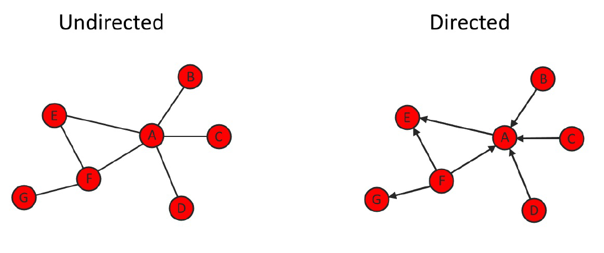
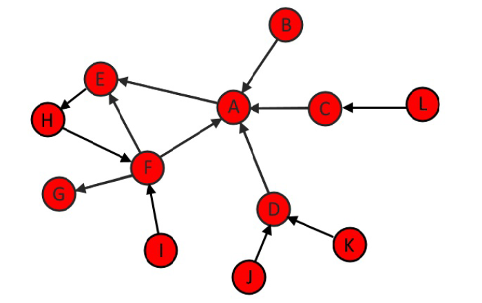
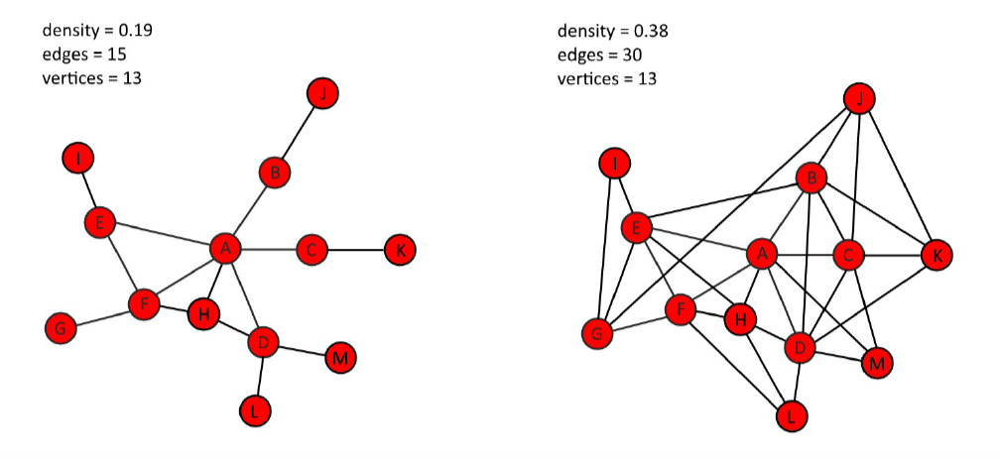

```{r setup, include=FALSE}
knitr::opts_chunk$set(error = TRUE, 
                      collapse = TRUE, 
                      comment = "#>")
set.seed(10^7*4)
library(styler)
library(lintr)
library(purrr)
```

# What are social networks?

A network graph depicts interconnections betweeen individuals. The presence or absence of each interconnection indicate whether there exists some form of relationship between each pair of individuals. Many different patterns of relationships may be illustrated as a social network. For instance, the graph you are looking at may represent friendship between individuals, flight routes between cities, even neural connections between brain regions. The term social network may refer to the visualization of the network graph or the underlying data that makes up the graph. 

In this course we will use **vertex** to refer to individuals. Although they are also referred to as **nodes** by many people. The interconnection between individuals or vertices are called **edges**. 

The network visualization, based on underlying data, can be represented in two structures: 

1. Adjacency matrix: Here, we have a network with our vertices in rows and columns. Where there is a 1 in a cell indicates that an edge exists between those two vertices. A 0 indicates that there is no edge present between those two vertices. From these adjacency matrices, we can mathematically derive many insights into the structure of the network and the importance of key vertices. 
2. Edgelist: A second key data structure that our network can be organized as is what is called an **edgelist**. This is a 2-column matrix or dataframe. Each row represents an edge between individual vertices in each column. This type of raw data is the most common form people collect before starting social network analysis.  

There are several packages for working with network data and visualizing networks in `R`. In this course, you will be using the `igraph` package. The first step is to create an igraph object. This can be done directly from raw data. Say you have the edgelist on the left using the `graph.edgelist()` function supply the raw data as 2-column matrix as the first argument. The second argument specifies that the data is _undirected_. 

```{r loadpackages}
library(igraph)
```

When you inspect the graph object `g`, it provides several pieces of information. Of note are the two numbers on the first line. The first number indicates there are seven(7) vertices in the network. The second number indicates there are seven(7) edges. Also useful is the final row, which shows all the edges in the network. It is possible to get lots of information directly from the igraph object. The function, `V()` will return all vertices in the network. The function, `E()` will return all the edges in the network. To find the total number of vertices or edges in the network, you can use the functions `gorder()` and `gsize()` respectively. 

```{r}
c1 <- c("A", "A", "A", "A", "A", "E", "F")
c2 <- c("B", "C", "D", "E", "F", "F", "G")
df <- cbind(c1, c2)

g <- graph.edgelist(as.matrix(df),
                    directed = FALSE)
g
```

```{r}
V(g)
E(g)
gorder(g)
gsize(g)
```

To generate a quick and simple visualization of the network, supply the graph object to the function, `plot()`

```{r}
plot(g)
```

# Practice I

## Creating an igraph object

Here you will learn how to create an igraph 'object' from data stored in an edgelist. The data are friendships in a group of students. You will also learn how to make a basic visualization of the network.

Each row of the friends dataframe represents an edge in the network.

```{r reading_friends_data}
library(here)
friends <- read.csv(here("datasets", "friends.csv"), sep = ",")
```

```{r creating_basic_graph_plot}
# Load igraph
# library(igraph)

# Inspect the first few rows of the dataframe 'friends'
head(friends)
dim(friends)

# Convert friends dataframe to a matrix
friends.mat <- as.matrix(friends)

# Convert friends matrix to an igraph object
g <- graph.edgelist(friends.mat, directed = FALSE)

# Make a very basic plot of the network
plot(g)
```

## Counting vertices and edges

A lot of basic information about a network can be extracted from an igraph object. In this exercise you will learn how to count the vertices and edges from a network by applying several functions to the graph object `g`.

Each row of the friends dataframe represents an edge in the network.

```{r counting_vertices_edges}
# Load igraph
# library(igraph)

# Subset vertices and edges
V(g)
E(g)

# Count number of edges
gsize(g)

# Count number of vertices
gorder(g)
```

# Network Attributes

Within any social network we generally have more information about vertices and edges than whether they exist or not. This information may be important when we analyze or visualize the network. In the example network from the previous video we already have one vertex attribute. Each vertex has a label or a name. We can see this in the igraph object where it says `attr: name`. Vertex attributes may be categorical or numerical. In friendship or coworker network other vertex attributes may include the age, gender, or political affiliation of the individual. In a network of flight routes within cities, a vertex attribute may be the population of the city or the country that the vertex is in. 

Edges may also have attributes. This may refer to the type of individual relationships the vertices have. For instance, it could be whether an interconnection is romantic or platonic in a friendship network or whether the flight route within cities is scheduled daily or weekly. The most common edge attribute is the _weight_ of the edge. The weight of a edge is visualized by adjusting the relative thickness of edges. The thicker the edge the higher the weight of the edge. In a friendship network, the weight of the edge may refer to how many times a week friends call each other. In a flight route network, it may refer to how many flights per week go between cities. 

To add these attributes directly to the network that already exist as igraph objects, you can use the functions `set_vertex_attr()` and `set_edge_attr()` for vertex and edge attributes respectively. The first argument is the graph object (`g` in the example below). The second argument is what you which to call the attribute. The final argument are the values to include. Here, we are adding the vertex attributes called _age_ and the edge attribute called _frequency_. You can view vertex and edge attributes by using the functions `vertex_attr()` and `edge_attr()` respectively.  

```{r}
g_1 <- graph.edgelist(as.matrix(df),
                    directed = FALSE)
g_1 <- set_vertex_attr(g_1, "age", value = c(20, 25, 21, 23, 24, 23, 22))

g_1 <- set_edge_attr(g_1, "frequency", value = c(2, 1, 1, 1, 3, 2, 4))

vertex_attr(g_1)

edge_attr(g_1)
```

Alternatively, if you already have all your attributes in a dataframe, then you can create an igraph object that automatically contains all attributes by using `graph_from_data_frame()`. 

```{r eval=FALSE}
vertices.df <- tibble::tribble(
  ~name, ~age,
  #----|----
  "A",  20,
  "B",  25,
  "C", 21,
  "D", 23,
  "E", 24,
  "F", 23,
  "G", 22
)

edges.df <- tibble::tribble(
  ~from, ~to, ~frequency,
  #----|----|----------
  "A",  "B", 2,
  "A",  "C", 1,
  "A",  "D", 1,
  "A",  "E", 1,
  "A",  "F", 3,
  "E",  "F", 2,
  "F",  "G", 4
)

graph_from_data_frame(d = edges.df, vertices = vertices.df, directed = FALSE)
```

Often you may which to inspect the igraph object to identify certain vertices or find edges that have some attribute. This is possible by subsetting the edges of the igraph object. In the first example, we are looking for all edges that include the vertex `E` using `inc()`. The name of the vertex needs to be in quotes. In the second example, we subset all edges that have a frequency of `>=` 3. This can be very useful in large network to identify any interesting relationships. 

```{r}
E(g_1)[[inc('E')]]
E(g_1)[[frequency >= 3]]
```

Finally, in this section you are going to further develop your igraph network visualization skills. It is possible to adjust basic igraph plots by adding parameters to the plot function. For instance, here we create a vertex attribute called color that igraph will use to plot vertex colors. We'll make all vertices over the age of 22 red and make the remainder white. We also specify to add black labels to each vertex using the `vertex.label.color` argument. 

```{r}
V(g_1)$color <- ifelse(
  V(g_1)$age > 22, "red", "white"
  )
plot(g_1, vertex.label.color = "black")
```

# Practice II

## Node attributes and subsetting

In this exercise you will learn how to add attributes to vertices in the network and view them.

```{r}
genders <- c("M", "F", "F", "M", "M", "M", "F", "M", "M", "F", "M", "F", "M", "F", "M", "M")
ages <- c(18, 19, 21, 20, 22, 18, 23, 21, 22, 20, 20, 22, 21, 18, 19, 20)
```

```{r}
# Inspect the objects 'genders' and 'ages'
genders
ages

# Create new vertex attribute called 'gender'
g <- set_vertex_attr(g, "gender", value = genders)

# Create new vertex attribute called 'age'
g <- set_vertex_attr(g, "age", value = ages)

# View all vertex attributes in a list
vertex_attr(g)

# View attributes of first five vertices in a dataframe
V(g)[[1:5]] 
```

## Edge attributes and subsetting

In this exercise you will learn how to add attributes to edges in the network and view them. For instance, we will add the attribute 'hours' that represents how many hours per week each pair of friends spend with each other.

```{r}
hours <- c(1, 2, 2, 1, 2, 5, 5, 1, 1, 3, 2, 1, 1, 5, 1, 2, 4, 1, 3, 1, 1, 1, 4, 1, 3, 3, 4)
```

```{r}
# View hours
hours

# Create new edge attribute called 'hours'
g <- set_edge_attr(g, "hours", value = hours)

# View edge attributes of graph object
edge_attr(g)

# Find all edges that include "Britt"
E(g)[[inc('Britt')]]  

# Find all pairs that spend 4 or more hours together per week
E(g)[[hours>=4]] 
```

## Visualizing attributes

In this exercise we will learn how to create igraph objects with attributes directly from dataframes and how to visualize attributes in plots. We will use a second network of friendship connections between students.

```{r}
friends1_edges <- read.csv(here("datasets", "friends1_edges.csv"), sep = ",")
friends1_nodes <- read.csv(here("datasets", "friends1_nodes.csv"), sep = ",")

```

```{r}
# Create an igraph object with attributes directly from dataframes
g1 <- graph_from_data_frame(d = friends1_edges, vertices = friends1_nodes, directed = FALSE)

# Subset edges greater than or equal to 5 hours
E(g1)[[hours >= 5]]  

# Set vertex color by gender
V(g1)$color <- ifelse(V(g1)$gender == "F", "orange", "dodgerblue")

# Plot the graph
plot(g1, vertex.label.color = "black")
```

# Network visualization principles

There are many ways of visualizing social networks. There are many things one can change about network vertices and edges such as their size and color or by adding text. There are also many different layouts that can be used to arrange vertices and edges. Many of these look very attractive whilst others particularly if there are large number of vertices and edges look incredibly bad. The most effective network visualizations should immediately provide insight and understanding to the viewer. There are a number of simple dos and donts that will help you to think about how best to depict your network visualizations. 

The most commonly adjusted features of vertices in network visualization are _size_, _labels_, _color_, and _shape_. You have already investigated how to change some of these in igraph in the previous exercises. Adjusting size is excellent for highlighting key or influential vertices. For instance, larger vertices may be those that are more central with a higher number of interconnections. Adding labels can also help identify key vertices. Although too much text on a network visualization can render it hard to read. 

Color and shape are particularly useful for communicating differences in categorical vertex attributes. For edges in addition to altering the thickness of lines representing edge weights, you can also change the color or linetype to indicate the type of interconnectivity in between vertices. These styles can be done separately or in conjunction with each other. The most important consideration is to ensure that they highlight those key pieces of information that you wish to communicate to the audience. 

Many different layout algorithms have been generated that assist with how best to layout vertices when creating network visualizations. The `igraph` package contains all of the most common ones and they can be selected using the layout argument when plotting. These algorithms will attempt to follow these general rules when visualizing network graphs:

1. Edges should not cross each other. Vertices should not overlap with each other as much as it is possible. 
2. Edges should ideally be as equal in length to each other as its feasible. Most algorithms also attempt to increase the symmetry of vertices in the layout and position key nodes toward the center. 

Here the same network graph is depicted using some of the layout options provided by igraph. 

```{r}
plot(g_1, layout = layout.fruchterman.reingold(g_1))
```

In igraph you can change the layout by adding the layout argument to the `plot()` function. When creating your own network it is worth trying different layouts to identify which allows key network information to be communicated most efficiently. 

# Practice III

## igraph network layouts

The igraph package provides several built in layout algorithms for network visualization. Depending upon the size of a given network different layouts may be more effective in communicating the structure of the network. Ideally the best layout is the one that minimizes the number of edges that cross each other in the network. In this exercise you will explore just a few of the many default layout algorithms. Re-executing the code for each plot will lead to a slightly different version of the same layout type. Doing this a few times can help to find the best looking visualization for your network.

```{r}
library(gridExtra)
library(grid)
```

```{r, out.width=0.5}
# Plot the graph object g1 in a circle layout
plot(g1, vertex.label.color = "black", layout = layout_in_circle(g1))

# Plot the graph object g1 in a Fruchterman-Reingold layout 
plot(g1, vertex.label.color = "black", layout = layout_with_fr(g1))

# Plot the graph object g1 in a Tree layout 
m <- layout_as_tree(g1)
plot(g1, vertex.label.color = "black", layout = m)

# Plot the graph object g1 using igraph's chosen layout 
m1 <- layout_nicely(g1)
plot(g1, vertex.label.color = "black", layout = m1)

# grid.arrange(p1, p2, p3, p4, ncol = 2)
# knitr::include_graphics(c(p1, p2))
```

## Visualizing edges

In this exercise you will learn how to change the size of edges in a network based on their weight, as well as how to remove edges from a network which can sometimes be helpful in more effectively visualizing large and highly clustered networks. In this introductory chapter, we have just scratched the surface of what's possible in visualizing `igraph` networks. You will continue to develop these skills in future chapters.

```{r}
# Create a vector of weights based on the number of hours each pair spend together
w1 <- E(g1)$hours

# Plot the network varying edges by weights
m1 <- layout_nicely(g1)
plot(g1, 
        vertex.label.color = "black", 
        edge.color = 'black',
        edge.width = w1,
        layout = m1)


# Create a new igraph object by deleting edges that are less than 2 hours long 
g2 <- delete_edges(g1, E(g1)[hours < 2])

# Plot the new graph 
w2 <- E(g2)$hours
m2 <- layout_nicely(g2)

plot(g2, 
     vertex.label.color = "black", 
     edge.color = 'black',
     edge.width = w2,
     layout = m2)
```

# Directed Networks

So far in this course we have been considering networks that are undirected. This means edges between vertices do not have a direction associated with them. The edges in undirected network simply indicate that a relationship of some kind exists between two vertices. However in many networks, edges do have directionality. In such directed networks, an arrow represents an _edge_ going from one vertex to another vertex. An example of a directed graph is a network of email exchanges. Each edge will represent one individual sending an email to a recipient. In the example here, A receives four edges and one outgoing edge to E. 

<center>
 
</center>

Using `igraph` it is relatively straightforward to determine if our network is directed or undirected. When calling the graph object, the first digit after igraph in the output will be a `U`, if it is undirected or a `D` if it is directed. Also, in directed network there are edges listed at the end of the object will have arrows indicating their directionality. It is also possible to test if a network is directed using the function `is.directed()` on the igraph object. This will return either true or false. Similarly, it is possible to determine if the network is weighted using the function `is.weighted()` on the igraph object. 

One reason for using network analysis is to identify which vertices are more important or influential to the overall network. The simplest measure of vertex influence is _degree_. In undirected networks, the total degree of a vertex is simply how many edges that vertex has. In directed networks, vertices have _out- degree_ and _in-degree_. The out-degree of a network represents how many out-going edges a vertex has. The in-degree of a network represents how many in-coming edges each vertex has. In our example network of email exchanges, `A` has an in-degree of 4 as it receives emails from 4 other vertices. `F` has an out-degree of 3 as they send emails to 3 other vertices. 

In igraph, there are several methods for determining if edges exist between vertices, and if they do, what direction they are. You can test if there is an edge exists between any two vertices using `[]` notation. A 1 is returned if a direct edge is present. You can show all edges to or from a vertex using `incident()` naming the vertex of interest with the second argument. The third argument `mode = "all"` indicates you want to see all edges--both incoming and outgoing. You can also find the vertices that edges originate from using `head_of()`. In this example, the second argument is `E(g)`, which indicates finding the origin of all edges that's in the network. 

The example network you will use is of a severe measles outbreak that spread through the town of Hagelloch, Germany in 1861 affecting 188 children. Each edge represents the transmission of measles from one individual to another. Visit this [link](https://rdrr.io/cran/outbreaks/man/measles_hagelloch_1861.html) to learn more about this dataset. 

# Practice I

## Directed igraph objects

In this exercise you will learn how to create a directed graph from a dataframe, how to inspect whether a graph object is directed and/or weighted and how to extract those vertices at the beginning and end of directed edges.

```{r directed_igraph_object}
library(readr)
library(dplyr)

# Get the graph object
measles <- read_csv(here("datasets", "measles.csv"))
glimpse(measles)

g <- graph_from_data_frame(measles, directed = TRUE)

# is the graph directed?
is.directed(g) # or is_directed()

# Is the graph weighted?
is.weighted(g) # or is_weighted()

# Where does each edge originate from?
table(head_of(g, E(g)))
```

## Identifying edges for each vertex

In this exercise you will learn how to identify particular edges. You will learn how to determine if an edge exists between two vertices as well as finding all vertices connected in either direction to a given vertex.

```{r}
# Make a basic plot
plot(g, 
     vertex.label.color = "black", 
     edge.color = 'gray77',
     vertex.size = 0,
     edge.arrow.size = 0.1,
     layout = layout_nicely(g))

# Is there an edge going from vertex 184 to vertex 178?
g['184', '178']

# Is there an edge going from vertex 178 to vertex 184?
g['178', '184']

# Show all edges going to or from vertex 184
incident(g, '184', mode = c("all"))

# Show all edges going out from vertex 184
incident(g, '184', mode = c("out"))
```

# Relationships between vertices

One of the advantages of social network analysis is that it is possible to evaluate how the overall patterns of relationships between vertices varies between networks. There are many methods for doing this. In this video you will learn how to identify neighbors of vertices as well as paths through networks. Here is our example network from the previous videos with some extras vertices and edges added. 

<center>

</center>

```{r}
df <- tibble::tribble(
  ~from, ~to,
  #----|----
  "B",  "A", 
  "C",  "A", 
  "L",  "C", 
  "D",  "A", 
  "K",  "D", 
  "J",  "D", 
  "F",  "A", 
  "I",  "F", 
  "A",  "E", 
  "F",  "G", 
  "H",  "F", 
  "F",  "E",
  "E",  "H"
)

g_example <- graph_from_data_frame(df, directed = TRUE)
```

```{r}
plot(g_example,
     layout = layout_nicely(graph = g_example))
```


The simplest method of assessing relationships between vertices is to identify the neighbors for a given vertex. This can be done using the `neighbors()` function in igraph. 

1. The first argument is the graph object represented below by `g`.
2. The second argument is the vertex of interest.
3. The third argument is to identify all neighbors as seen here using `mode=c("all")`.

```{r}
neighbors(g_example, "F", mode = c("all"))
```

It is also possible to only identify neighbors that `F` projects an edge to or neighbors that `F` receives an edge from. Although vertices may not be connected directly with an edge, they may have an indirect influence on each other. For instance, in the example network, `F` and `D` are not connected to each other, but they do share a common connection with one of the vertex, `A`. You can identify this connection using the function, `intersection()` in igraph. 

1. Determine the neighbors of each vertex of interest and assign this objects. Here, we assign the neighbors of `F` to `x` and the neighbors of `D` to `y`. 

```{r}
x <- neighbors(g_example, "F", mode=c("all"))
y <- neighbors(g_example, "D", mode=c("all"))
```

2. Next, we can use intersection 

```{r}
intersection(x, y) 
```

This function will return those vertices where both `F` and `D` are connected. 

One measure of how well connected a network is to measure the lengths of paths between all pairs of vertices. If a vertex is reachable from its neighbor then its path length---aka _geodesic distance_---between them is 1. So, J and D have a path length of 1 as do F and A. Similarly, L and A have a path length of 2, as two connections are required to go from L to A. 

Commonly in network analysis, we are interested in the longest such path that exist in a given network. This is also called the _diameter_ of the network. In this network the diameter colored in blue is 6. You can find the diameter is any network using `farthest_vertices()` function, which will return the diamater distance and the two vertices at the either end of the longest path. `get_diameter()` will return the exact sequence of connections. If there is more than one longest path, these functions will return only one of the possible longest paths. 

```{r}
farthest_vertices(graph = g_example)

get_diameter(g_example)
```

It is also possible to identify all vertices reachable in n-steps from a given vertex using the function `ego()`. 

1. The first argument is the graph object. 
2. The second is the number of steps.
3. The third is the vertex of interest. 
4. The final argument is the direction. Here we are interested in identifying all vertices reachable in two connections going outward from `F`. G, E, A are all reachable in one step. Additionally, H is reachable in two steps via E. No other vertex can be reach in two outgoing steps from F. 

```{r}
ego(g_example, 2, 'F', mode=c('out'))
```

# Practice II

## Neighbors

Often in network analysis it is important to explore the patterning of connections that exist between vertices. One way is to identify neighboring vertices of each vertex. You can then determine which neighboring vertices are shared even by unconnected vertices indicating how two vertices may have an indirect relationship through others. In this exercise you will learn how to identify neighbors and shared neighbors between pairs of vertices.

```{r}
# Identify all neighbors of vertex 12 regardless of direction
neighbors(g, '12', mode = c('all'))

# Identify other vertices that direct edges towards vertex 12
neighbors(g, '12', mode = c('in'))

# Identify any vertices that receive an edge from vertex 42 and direct an edge to vertex 124
n1 <- neighbors(g, '42', mode = c('out'))
n2 <- neighbors(g, '124', mode = c('in'))
intersection(n1, n2)
```

## Distances between vertices

The inter-connectivity of a network can be assessed by examining the number and length of paths between vertices. A path is simply the chain of connections between vertices. The number of intervening edges between two vertices represents the geodesic distance between vertices. Vertices that are connected to each other have a geodesic distance of 1. Those that share a neighbor in common but are not connected to each other have a geodesic distance of 2 and so on. In directed networks, the direction of edges can be taken into account. If two vertices cannot be reached via following directed edges they are given a geodesic distance of infinity. In this exercise you will learn how to find the longest paths between vertices in a network and how to discern those vertices that are within n connections of a given vertex. For disease transmission networks such as the measles dataset this helps you to identify how quickly the disease spreads through the network.

```{r}
# Which two vertices are the furthest apart in the graph ?
farthest_vertices(g) 

# Shows the path sequence between two furthest apart vertices.
get_diameter(g)  

# Identify vertices that are reachable within two connections from vertex 42
ego(g, 2, '42', mode = c('out'))

# Identify vertices that can reach vertex 42 within two connections
ego(g, 2, '42', mode = c('in'))
```

# Important and influential vertices

There are a number of ways for identifying which vertices may be the most important or influential. Measures of vertex importance include:

* Degree: Here we consider _a vertex that has many connections_ i.e. has a high degree to be important.

* Eigenvector centrality: We may further then consider vertices to be even more influential if they are connected to other vertices that are themselves highly interconnected in the network. These vertices are described as having a high _eigenvector centrality_. 

There are many other ways of calculating influence including:  

* Betweenness

* Closeness centrality: 

* Pagerank centrality

In the next few exercises, you are going to focus on two of these: degree and betweenness. 

Here is our example email network with with updated out-degrees and in-degrees for each vertex. From this we'll consider that `F` is an influential vertex in transmitting information and `A` appear to influential in receiving information. It is relatively simple to calculate the degree for all vertices in the network using the `degree()` function. The first argument of this function is the graph object. The second argument determines whether you wish to calculate the out-degree, the in-degree or the total degree, which is the sum of out and in-degrees. 

```{r}
degree(g_example, mode = c("out"))
degree(g_example, mode = c("in"))
```

A slightly more interesting index of vertex importance is *betweenness*. This measures how frequently a vertex lies on the shortest path between any two vertices in the network. It is equivalent to how critical each vertex is to the flow of information and through a network. Individuals with high betweenness are key bridges between different path of a network. Individuals with low betweenness are not that significant to the overall connectness of the network. As an example, let us consider the path between I and H. There are two possible paths. The first is: I -> F -> E -> H (that is three steps). The other path is: I -> F -> A -> E -> H (four steps). Therefore, the I -> F -> E -> H path is shortest. 

```{r, eval=FALSE}
# Path between I & H
I -> F -> E -> H 
I -> F -> A -> E -> H
```

For many other pairs of vertices in this network the shortest and often the only path goes through vertex A.  K -> E and B -> G both pass through A. 

```{r, eval=FALSE}
# Path between K & E
K -> D -> A -> E
# Path between B & G
B -> A -> E -> H -> F -> G
```

You can calculate the betweenness of each vertex by using the `betweenness()` function. The first argument should be the graph object and the second argument should be TRUE or FALSE as to whether to consider the graph is directed or not. This method will give a raw betweenness score. However, it is also possible to normalize the between score by adding the third argument `normalize = TRUE`. 

```{r}
betweenness(g_example, directed = TRUE)
```

```{r, eval = FALSE}
sort(round(betweenness(g_example, directed = TRUE,
            normalized = TRUE), 2))
```

As, we can see from our visual inspection of the network earlier, the betweenness score of this network suggests that A is an important vertex in the network followed by E, F, and H. 

# Practice III

## Identifying key vertices

Perhaps the most straightforward measure of vertex importance is the degree of a vertex. The out-degree of a vertex is the number of other individuals to which a vertex has an outgoing edge directed to. The in-degree is the number of edges received from other individuals. In the measles network, individuals that infect many other individuals will have a high out-degree. In this exercise you will identify whether individuals infect equivalent amount of other children or if there are key children who have high out-degrees and infect many other children.

```{r}
# Calculate the out-degree of each vertex
g.outd <- degree(g, mode = c("out"))

# View a summary of out-degree
table(g.outd)

# Make a histogram of out-degrees
hist(g.outd, breaks = 30)

library(ggformula)

gf_histogram(~ g.outd, bins = 30)

# Find the vertex that has the maximum out-degree
which.max(g.outd)
```

## Betweenness

Another measure of the importance of a given vertex is its betweenness. This is an index of how frequently the vertex lies on shortest paths between any two vertices in the network. It can be thought of as how critical the vertex is to the flow of information through a network. Individuals with high betweenness are key bridges between different parts of a network. In our measles transmission network, vertices with high betweenness are those children who were central to passing on the disease to other parts of the network. In this exercise, you will identify the betweenness score for each vertex and then make a new plot of the network adjusting the vertex size by its betweenness score to highlight these key vertices.

```{r}
# Calculate betweenness of each vertex
g.b <- betweenness(g, directed = TRUE)

# Show histogram of vertex betweenness
hist(g.b, breaks = 80)

# gf_histogram(~ g.b, binwidth = 5)

# Create plot with vertex size determined by betweenness score
plot(g, 
     vertex.label = NA,
     edge.color = 'black',
     vertex.size = sqrt(g.b)+1,
     edge.arrow.size = 0.05,
     layout = layout_nicely(g))
```

## Visualizing important nodes and edges

One issue with the measles dataset is that there are three individuals for whom no information is known about who infected them. One of these individuals (vertex 184) appears ultimately responsible for spreading the disease to many other individuals even though they did not directly infect too many individuals. However, because vertex 184 has no incoming edge in the network they appear to have low betweenness. One way to explore the importance of this vertex is by visualizing the geodesic distances of connections going out from this individual. In this exercise you shall create a plot of these distances from this patient zero.

```{r}
# Make an ego graph
g184 <- make_ego_graph(g, diameter(g), nodes = '184', mode = c("all"))[[1]]

# Get a vector of geodesic distances of all vertices from vertex 184 
dists <- distances(g184, "184")

# Create a color palette of length equal to the maximal geodesic distance plus one.
colors <- c("black", "red", "orange", "blue", "dodgerblue", "cyan")

# Set color attribute to vertices of network g184.
V(g184)$color <- colors[dists+1]

# Visualize the network based on geodesic distance from vertex 184 (patient zero).
plot(g184, 
     vertex.label = dists, 
     vertex.label.color = "white",
     vertex.label.cex = .6,
     edge.color = 'black',
     vertex.size = 7,
     edge.arrow.size = .05,
     main = "Geodesic Distances from Patient Zero"
     )
```

# Network Structure

In this chapter you are going to work with the forest gump network dataset. You will use this learn various methods for describing a structure and substructure of social networks. Each edge of the forest gump social network indicate that those two characters were, in at least, one scene of the movie together. Therefore, this network is undirected. 

## Eigenvector Centrality

To familiarize yourself with the network, you will first identify key vertices using eigenvector centrality and plot the network. 

> Eigenvector centrality is a measure of how well connected a vertex is. 

Vertices with the highest eigenvector centrality are those that are connected to many others, but especially to other vertices who themselves are highly connected to others. In `igraph` you calculate eigenvector centrality by applying the `eigen_centrality()` function to the graph object. The returned object is a list containing many things but the actual centrality scores for each vertex can be found in the named element `vector`. As you can see in this example undirected network, the vertices F, A, E, and H are particularly high in eigenvector centrality. 

```{r}
sort(eigen_centrality(g_example)$vector, decreasing = TRUE)
```

## Density

Up till now you have largely been calculating measures of vertices such as degree, betweenness, and eigenvector centrality. However, there are also family of measures that tell us something about the overall pattern or structure of networks. The simplest measure of the overall structure of a network is its **_density_**. This is equivalent to the proportion of edges that **_actually do exist_** in a network out of all those that **_potentially could exist_** in a network. In this network of 13 vertices, there could potentially be 78 edges if all the vertices were connected. 

<center>

</center>

In this network on the left there are 15 edges so the density is 0.19, equal to 19% of potential edges being present. The network on the right has 30 edges, which is a density of 0.38 i.e. 38% of all potential ties exist.  

> Density is therefore a measure of how interconnected a network is. 

It can simply be calculated in `igraph` using `edge_density()`. 

```{r}
edge_density(g_example)
```

## Average path length

Another measure of the interconnectivity of a network is **_average path length_**. This is calculated by determining the mean distance of the length of the shortest between all pairs of the vertices in the network. In `igraph`, this is calculated by applying the function `mean_distance()` to the graph and instructing the function whether the graph is undirected or directed. 

The network on the left has an average path length of 2.47 whereas the network on the right has a average path length of 1.81. This is because the average shortest path between vertices is reduced with an increase in the number of vertices. For instance, the shortest path between G and K on the left is 4 steps (G -> F -> A -> C -> K). On the right it is 2 steps (G -> J -> K). This suggest that the network on the right is more interconnected and facilitates flow between vertices more readily. 

# Practice I

## Forest Gump Network

In this chapter you will use a social network based on the movie Forrest Gump. Each edge of the network indicates that those two characters were in at least one scene of the movie together. Therefore this network is undirected. To familiarize yourself with the network, you will first create the network object from the raw dataset. Then, you will identify key vertices using a measure called eigenvector centrality. Individuals with high eigenvector centrality are those that are highly connected to other highly connected individuals. You will then make an exploratory visualization of the network.

```{r forest_gump_network}
gump <- read_delim(here("datasets", "gump.csv"), delim = ",")

# Inspect Forrest Gump Movie dataset
head(gump)

# Make an undirected network
g <- graph_from_data_frame(gump, directed = FALSE)

# Identify key nodes using eigenvector centrality
g.ec <- eigen_centrality(g)
which.max(g.ec$vector)

# Plot Forrest Gump Network
plot(g,
vertex.label.color = "black", 
vertex.label.cex = 0.6,
vertex.size = 25*(g.ec$vector),
edge.color = 'gray88',
main = "Forrest Gump Network"
)
```

## Network density and average path length

The first graph level metric you will explore is the density of a graph. This is essentially the proportion of all potential edges between vertices that actually exist in the network graph. It is an indicator of how well connected the vertices of the graph are.

Another measure of how interconnected a network is average path length. This is calculated by determining the mean of the lengths of the shortest paths between all pairs of vertices in the network. The longest path length between any pair of vertices is called the diameter of the network graph. You will calculate the diameter and average path length of the original graph `g`

```{r network_density_path_length}
# Get density of a graph
gd <- edge_density(g)

# Get the diameter of the graph g
diameter(g, directed = FALSE)

# Get the average path length of the graph g
g.apl <- mean_distance(g, directed = FALSE)
g.apl
```

# Random graphs

Generating random graphs is an important method for investigating how likely or unlikely other network metrics are likely to occur given certain properties of the original graph. The simplest random graph is one that has the same number of vertices as your original graph and approximately the same density as the original graph. Here you will create one random graph that is based on the original Forrest Gump Network.

```{r random_graphs}
# Create one random graph with the same number of nodes and edges as g
g.random <- erdos.renyi.game(n = gorder(g), p.or.m = gd, type = "gnp")

g.random

plot(g.random)

edge_density(g.random)

mean_distance(g.random, directed = FALSE)
```

## Network Randomizations

In the previous exercise you may have noticed that the average path length of the Forrest Gump network was smaller than the average path length of the random network. If you ran the code a few times you will have noticed that it is nearly always lower in the Forrest Gump network than the random network. What this suggests is that the Forrest Gump network is more highly interconnected than each random network even though the random networks have the same number of vertices and approximately identical graph densities. Rather than re-running this code many times, you can more formally address this by creating 1000 random graphs based on the number of vertices and density of the original Forrest Gump graph. Then, you can see how many times the average path length of the random graphs is less than the original Forrest Gump network. This is called a randomization test.

```{r}
# Generate 1000 random graphs
gl <- vector('list',1000)
  
for(i in 1:1000){
  gl[[i]] <- erdos.renyi.game(n = gorder(g), p.or.m = gd, type = "gnp")
}

# Calculate average path length of 1000 random graphs
gl.apls <- unlist(lapply(gl, mean_distance, directed = FALSE))

# Plot the distribution of average path lengths
hist(gl.apls, xlim = range(c(1.5, 6)))
abline(v = g.apl, col = "red", lty = 3, lwd = 2)

# Calculate the proportion of graphs with an average path length lower than our observed
mean(gl.apls < g.apl)
```

Great work! As you can see, the Forrest Gump network is far more interconnected than we would expect by chance as zero random networks have an average path length smaller than the Forrest Gump network's average path length.
