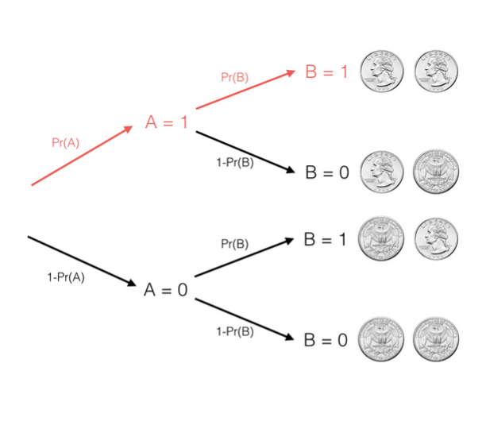
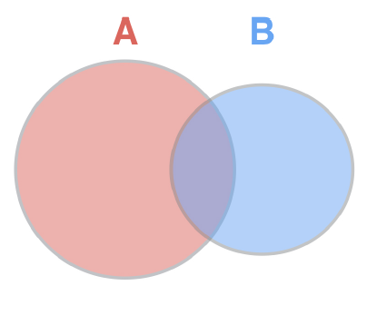

  
```{r setup}
knitr::opts_chunk$set(error = TRUE, 
                      collapse = TRUE, 
                      comment = "#>")
library(styler)
library(lintr)
library(purrr)
```

# Flipping coins in R

## Simulating coin flips

In these exercises, you'll practice using the `rbinom()` function, which generates random "flips" that are either 1 ("heads") or 0 ("tails").

```{r flipping_1_coin}
# Generate 10 separate random flips with probability .3
args(rbinom)
rbinom(n = 10, size = 1, p = 0.3)
```

`rbinom()` takes three arguments:

* `n` = number of observations i.e. the number of separate random flips
* `size` = number of trials i.e. number of coins
* `p` = probability of success on each trial. 

In this case of a coin flip, `p` is the probability that the coin returns head. Note: if a coin lands on head, we call that a successful trial. 

## Simulating draws from a binomial

In the last exercise, you simulated 10 separate coin flips, each with a 30% chance of heads. Thus, with `rbinom(10, 1, .3)` you ended up with 10 outcomes that were either 0 ("tails") or 1 ("heads").

But by changing the second argument of `rbinom()` (currently `1`), you can flip multiple coins within each draw. Thus, each outcome will end up being a number between *0 and 10*, showing the number of flips that were heads in that trial.

```{r flipping_10_coins}
# Generate 100 occurrences of flipping 10 coins, each with 30% probability
rbinom(n = 100, size = 10, p = 0.3)
```

# Density and cumulative density

When you flip a fair coin 10 times, what's the most likely number of heads? Well, since heads or tails are equally likely, you can probably figure out that the most likely outcome is 5 heads and 5 tails. Say, I offer you a bet if it exactly that result I will pay you a dollar(\$) otherwise you'll pay me a dollar. Should you take the bet? To answer this, we'll have to find out the probability of a binomial random variable `X` with those parameters: 10 flips with a probability of 0.5.

$$X  \sim \textrm{Binomial(10, .5)} $$ 

results in a outcome of 5 which can be expressed as :

$$Pr (X = 5)$$

One way to find out is to simulate many draws from X, say 1000000 and then see how common each outcome is. We can use a neat trick in R to calculate the fraction equal to 5 directly. The expression `flips == 5` compares each item in the vector to 5, we can then use the `mean()` function to find the fraction of comparisons that are `TRUE`. This works because the `mean()` function treats TRUE as 1 and FALSE as 0. Thus, `mean(flips == 5)` gives the fraction of values equals to 5. You're going to be using this trick with mean a lot in the exercises whenever you estimate values with simulation. In this case we found that the fraction of outcomes equals 5 is 0.2450 i.e. there is a 24.5% chance---this is called the density of the binomial at that point. 

```{r plotting_flips, message=FALSE}
# learnr::run_tutorial("introduction", package = "ggformula")
set.seed(10^7*4)
library(ggformula)
flips <- rbinom(100000, 10, .5)
mean(flips == 5) 
gf_histogram( ~ flips, bins = 10, 
              color = "orange", 
              fill = "navy blue", 
              xlab = "Number of heads") + ggtitle("Histogram of simulation: 100000 obs & 10 trials & p = 0.5")
```

Simulation is a very useful to understand a distribution and to answer questions about its behavior. But, in the case of the binomial distribution, R also provides a way to calculate the exact probability density using the `dbinom()` function.

```{r}
dbinom(5, 10, .5)
```

`dbinom()` takes three arguments:

* `d` = the outcome we are estimating the density at, 5. 
* `size` = number of coins, 10
* `p` = probability of each being heads, 0.5. 

Notice, that this gives the result of 0.246. This confirms the result from our simulation of the probability. Similarly, we could calculate the probability density of getting exactly 6 heads or all 10 being heads by changing the first argument. Find the probability through both simulation and exact calculation will be a common task in this course. 

```{r}
dbinom(6, 10, .5)
dbinom(10, 10, .5)
```

So, now you know not to take my bet. More likely than not, we won't exactly 5 heads set of 10. What if I offer you a new bet: I'll pay you a \$ if 4 or fewer come up heads otherwise you have to pay me. 

$$X  \sim \textrm{Binomial(10, .5)} $$ 

results in a outcome equal to or less than 4 which can be expressed as:

$$Pr (X \le 5)$$

This describes the cumulative density of the binomial. The process of calculating the cumulative density is similar to process of calculating the density. You can estimate it using simulation. We generate an 100000 draws from the binomial distribution then instead of using `==` we do `mean(flips <= 4)`. 

```{r}
mean(flips <= 4)
```

You can see that this was true for about 37.8% of the simulations. Much like the density, R provides function to get the exactly cumulatve density of the binomial. Rather than `dbinom()` you use `pbinom()`. 

```{r}
pbinom(4, 10, 0.5)
```

This results confirms the probability is about 37.7% that a binomial with 10 flips gets 4 or fewer heads. In other words, you shouldn't stil take my bet. 

## Calculating density of a binomial

If you flip 10 coins each with a 30% probability of coming up heads, what is the probability exactly 2 of them are heads?

```{r}
# Calculate the probability that 2 are heads using dbinom
dbinom(2, 10, 0.3)

# Confirm your answer with a simulation using rbinom
mean(rbinom(10000, 10, 0.3) == 2)
```

## Calculating cumulative density of a binomial

If you flip ten coins that each have a 30% probability of heads, what is the probability at least five are heads?

```{r}
# Calculate the probability that at least five coins are heads
1 - pbinom(4, 10, 0.3)

# Confirm your answer with a simulation of 10,000 trials
mean(rbinom(10000, 10, 0.3) >= 5)
```

## Varying the number of trials

In the last exercise you tried flipping ten coins with a 30% probability of heads to find the probability at least five are heads. You found that the exact answer was `1 - pbinom(4, 10, .3)` = 0.1502683, then confirmed with 10,000 simulated trials.

Did you need all 10,000 trials to get an accurate answer? Would your answer have been more accurate with more trials?

```{r}
# Here is how you computed the answer in the last problem
# mean(rbinom(10000, 10, .3) >= 5)

# Try now with 100, 1000, 10,000, and 100,000 trials
mean(rbinom(100, 10, .3) >= 5)
mean(rbinom(1000, 10, .3) >= 5)
mean(rbinom(10000, 10, .3) >= 5)
mean(rbinom(100000, 10, .3) >= 5)
```

# Expected value and variance

## Expected value

When we talk about a probability distribution we are often interested in summarizing it into a few descriptive statistics. Two of the most interesting properties of a distribution are where the distribution is centered and how widely spread out it is. We describe this with the *expected value* and the *variance*. The expected value is the mean of the distribution. If you imagine we drew an infinite number of values in the distribution, the expected value is what the average of all those will be. This puts it right in the center of the distribution. 

Let's try to find the expected value of the binomial distribution with `size` (10) and `p` (0.5). We can't draw an infinite number of values, but we can draw a lot of them. We can use `rbinom()` to simulate 100000 draws with size (10) and p (0.5). Then use the `mean()` function to take the average of those draws. We see the average as very close to 5. That's the center of the distribution. 

```{r}
mean(flips)
```

$$X  \sim \textrm{Binomial(size, p)} $$ 

If we try to sample with a size of 100 and p of 0.2, we find that the mean is very close to 20. As you might noticed from these examples, there is a general rule. You can get the expected value of a binomial distribution by multiplying size i.e. the number of flips with p i.e. the probability each is heads:

$$\textrm{E[X] = size . p} $$ 

```{r}
mean(rbinom(100000, 100, 0.2))
```

## Variance

The expected value measures the center of the distribution, but we also want to measure how spread out the results are. Statisticians use the *variance* to measure this. Variance is the average^2^ distance of each value from the mean of the sample. The variance isn't quite as intutive as the mean, but it has useful mathematical properties that will become clear in this course. `R` provides the `var()` function to calculate variance froma particular sample. So we can simulate a 100000 draws of a binomial distribution with size (10) and p (0.5). Then use `var()` to find the variance of that distribution. We that the variance is very close to 2.5. Note: that the mean of this distribution is 5. That means 2.5 is the average^2^ distance between 5 and 1 random draw. 

```{r}
var(rbinom(100000, 10, 0.5))
```

The variance of a binomial distribution follows a particular general rule:

$$Var(X) = \textrm{size . }  p(1 - p) $$ 

So, for example the variance with the binomial parameters of 10 and 0.5 is:

$$Var(X) = \textrm{10 . }  0.5(1 - 0.5) = 2.5$$ 

This is exactly what we saw in the simulation. We could try this with another binomial distribution with size (100) and p(0.2). 

$$Var(X) = \textrm{100 . }  0.2(1 - 0.2) = 16$$ 

```{r}
var(rbinom(100000, 100, 0.2))
```

Just like the expected value, simulation gives us a way to estimate properties of a distribution by drawing many values while mathematical rules can also give you an exact answer. 

We thus have two rules for the properties of a binomial distribution:

1. The expected value of a binomial distribution is $\textrm{E[X] = size . p} $
2. The variance of the binomial distribution is $\textrm{Var(X) = size . p(1 - p)} $

## Calculating the expected value

What is the expected value of a binomial distribution where 25 coins are flipped, each having a 30% chance of heads?

```{r}
# Calculate the expected value using the exact formula
25 * 0.3

# Confirm with a simulation using rbinom
mean(rbinom(10000, 25, 0.3))
```

## Calculating the variance

```{r}
# Calculate the variance using the exact formula
25 * 0.3 * (1 - 0.3)

# Confirm with a simulation using rbinom
var(rbinom(10000, 25, 0.3))
```

# Laws of probability

## Probability of event A and event B

So far we've been using coin flips as a simple example of random phenomena, but let's step back from that and talk about what a coin flip represents: a random variable that is either yes or no. For example we can say:

* A represents a coin is heads. A either happens (A = 1) or it doesn't (A = 0)
* B represents a coin is tails

Note: Throughout this chapter we'll use events and coin flips interchangeably. We could say A is an event with a probability of 20% or A is a coin with 20% probability of being heads. 

In reality these events could represent a probability that it snowing outside or a probability someone will click an advertisement on a website. In this chapter we'll learn some of the mathematical laws that govern these kinds of random events and let us make predictions about them. 

Now, let's consider if you've two events: A and B. 

* Event A is the result of one flip (either 1 for heads and 0 for tails each with some probability). 
* Event B is the result of a second flip. 

Now, suppose you want to know the probability of A and B i.e. the probability that both flips are heads.  

Consider this in terms of nested branching. First, you flip coin A with some probability that it results in heads and some probability that it results in tails. This branches into two possibilities: A = 1 or A = 0. Second, you flip coin B, this causes both events to branch again separately. Only that one branch where A and B resulted in 1 (or heads) counts as A and B. We represent that by multiplying those two probabilities to represent the probability of using one branch after the other. 

> The probability of A and B is the probability of A times the probability of B. 

Note that this is true only if events A and B appear independent i.e. if the result of A doesn't affect the probability of B. This is generally true of two different coin flips and of all the cases we'll examine in this chapter. 

Two events A and B are independent if

$$\textrm{P(A and B)} = P(A) \cdot P(B)$$

and we write $A \amalg B$. A set of events $A_i : i \in I$ is independent if

$$P\Bigg(\displaystyle\bigcap_{i \in J}A_i\Bigg) = \prod_{i \in J}P(A_i)$$  

for every finite subset J of _I_. if A and B are not independent, we write

$$A \not\!\perp\!\!\!\perp B$$

## Simulating two coins

To confirm this, let's try a simulation of many coin flips. 

```{r}
A <- rbinom(100000, 1, 0.5)
```

Notice that we've set the parameters so that each draw has only one flip and each flip has a 50% chance of been heads. We can then simulate a 100000 flips of coin B seperately.

```{r}
B <- rbinom(100000, 1, 0.5)
```

Once, we have all the flips we can then compare all the pairs of them. `R` let's us compare them with the `&` operator and results in `TRUE` *if and only if* both A and B are 1. We thus get a sequence of TRUEs and FALSEs for each of the 100000 pairs. Once, we have this we can take the mean to find out the percentage that are TRUE just as we did in the simulations in the last chapter. 

```{r}
mean(A & B)
```

In this case, we see that A and B were both TRUE in about 25% of the simulations. This is the probability that two fair coins will bth result in heads. This confirms our rule:

$$\textrm{P(A and B)} = P(A) \cdot P(B)$$

OR

$$\textrm{P(A and B)} = 0.5 \cdot 0.5 = 0.25$$

We could the same simulation approach if the coin weren't fair i.e. if A and B do not have the same probability. For example, we can set event A to have a 10% probability and event B to have a 70% probability by setting the third argument of `rbinom()` to 0.1 and 0.7 respectively. When we then combine A and B, we see that about 7% of the pairs are both TRUE. 

```{r}
A <- rbinom(100000, 1, 0.1)
B <- rbinom(100000, 1, 0.7)
mean(A & B)
```

This again matches what we'll expect: The probability of 

$$\textrm{P(A and B)} = 0.1 \cdot 0.7 = 0.07$$

## Simulating the probability of A and B

```{r}
# Simulate 100,000 flips of a coin with a 40% chance of heads
A <- rbinom(100000, 1, 0.4)

# Simulate 100,000 flips of a coin with a 20% chance of heads
B <- rbinom(100000, 1, 0.2)

# Estimate the probability both A and B are heads
mean(A & B)
```

## Simulating the probability of A, B, and C

```{r}
# You've already simulated 100,000 flips of coins A and B
A <- rbinom(100000, 1, .4)
B <- rbinom(100000, 1, .2)

# Simulate 100,000 flips of coin C (70% chance of heads)
C <- rbinom(100000, 1, .7)

# Estimate the probability A, B, and C are all heads
mean(A & B & C)
```

## Probability of A or B

Suppose we flip a coin twice, what is the probability that *at least one* of the flips is heads? You can imagine this as two overlapping circles in a venn diagram? One circle represents whether event A happened such as the first flip being heads and one whether B happens such as the second flip being heads. The probability that either happens is the total region. 

To find that overall probability you could start by adding up the areas of the two circles but then you'll be double the region they overlap so you have to substract that as well. This means:

$$P\textrm{(A or B)} = P(A) + P(B) - P\textrm{(A and B)}$$

In the last lesson you learned that as long as the event are independent 

$$P\textrm{(A or B)} = P(A) + P(B) - P(A) \cdot P(B)$$

So, if A and B are independent flips of a fair coin we can take the probability of the first being heads (50%) plus the probability of the second being heads (50%) and then substract that from the probability they both are heads. 

$$P\textrm{(A or B)} = .5 + .5 - .5 \cdot .5 = .75$$

Let's try this in a simulation

```{r}
A <- rbinom(100000, 1, .5)
B <- rbinom(100000, 1, .5)
mean(A | B)
```

Here you can see the number is about 75%; this matches the number we earlier got from our rule. This also works if our coins are biased. 

```{r}
A <- rbinom(100000, 1, .2)
B <- rbinom(100000, 1, .6)
mean(A | B)
```

We can get the same answer using the rule:

$$P\textrm{(A or B)} = .2 + .6 - .2 \cdot .6 = .68$$

One advantage of simulation approach is that it extends the cases where mathematical solutions will get cumbersome. For example, what if we have three coins, A, B, and C and we want to know the probability that any of the three of them is heads i.e. $P\textrm{(A or B or C}$. The formular for three events is a bit complicated and you don't need to memorize it. 

$$P\textrm{(A or B or C)} = P(A) + P(B) + P(C) - P\textrm{(A and B)} \\ - P\textrm{(A and C)} - P\textrm{(B and C)} \\+ P\textrm{(A and B and C)} $$

But if you simulate the events A, B, and C, you can simply combine all of them using the `mean()` function with the `|` (logical OR) operator. You can do this even with 4 or 5 events. 

## Solving for probability of A or B

$$P\textrm{(A or B)} = .6 + .1 - .6 \cdot .1 = .64$$

## Simulating probability of A or B

```{r}
# Simulate 100,000 flips of a coin with a 60% chance of heads
A <- rbinom(100000, 1, .6)

# Simulate 100,000 flips of a coin with a 10% chance of heads
B <- rbinom(100000, 1, .1)

# Estimate the probability either A or B is heads
mean(A | B)
```

## Probability either variable is less than or equal to 4

Suppose X is a random Binom(10, .6) variable (10 flips of a coin with 60% chance of heads) and Y is a random Binom(10, .7) variable (10 flips of a coin with a 70% chance of heads), and they are independent.

What is the probability that either of the variables is less than or equal to 4?

```{r}
# Use rbinom to simulate 100,000 draws from each of X and Y
X <- rbinom(100000, 10, .6)
Y <- rbinom(100000, 10, .7)

# Estimate the probability either X or Y is <= to 4
mean(X <= 4 | Y <= 4)

# Use pbinom to calculate the probabilities separately
prob_X_less <- pbinom(4, 10, .6)
prob_Y_less <- pbinom(4, 10, .7)

# Combine these to calculate the exact probability either <= 4
prob_X_less + prob_Y_less - prob_X_less * prob_Y_less
```

## Multiplying random variables

Imagine I flip this fair coin 10 times and count the number of heads, then I take that number and triple it. What could you tell me about the resulting number? You don't exactly what it is but could you tell me its mean or its variance? Just like there are laws of probability for combining events. There are laws for manipulating random variables. In these next lessons, we'll learn to multiply random variables with a constant or combine them together. 

Suppose X is a random variable containing the result of flipping a fair coin 10 times, we could take draws from X. One draw could be 5 another could be 7 and yet another could be 4---each representing 10 flips of a coin. In probability it is important to get into the habit of manipulating random variables kind of if they are like algebraic symbols. 

$$X \sim \texttt{Binomial}(10, .5)$$

So, we could imagine defining a new random variable Y, which is 3 times X. If X were 5, Y will be 15, and if X were 7, Y will be 21. 

$$ Y \sim 3 \cdot X$$

Now, we want to know the properties of Y such as its expected value and variance. To do that imagine a histogram of X and compare it to a histogram of X * 3 = Y. Notice that the shape of Y is the same, but it is larger and more spread out. So, we'll expect both the expected value and variance to increase. 

Let's see what the exact effect of multiplying by 3 is through simulation. Try taking 100000 draws from X---a binomial with 10 flips of a fair coin. We can take the mean and check that the expect value is about 5 i.e. 10 flips multiplied by the probability of 0.5. 

```{r}
X <- rbinom(100000, 10, 0.5)
mean(X)
```

To get a sample from Y, we multiply our sample of X by 3. Note: 3 * X will multiply every individual value by 3. So we went from a 100000 draws from X to a 100000 draws from Y. We can find the expected value of Y by taking the `mean()` and we see that it is about 15. Thus, when we multiply a random variable by 3 we also multiply the expected value by 3. This makes sense because we can see that the distribution has roughly the same shape, it's just three times larger. This is a general rule. When you multiply a random variable by a constant _k_, you also multiply the expected value by _k_. 

```{r}
Y <- 3 * X
mean(Y)
```

We can also examine what happens to the variance. The variance of X is about 2.5. Recall that variance is size * p * 1 - p. Now, when we multiply it by 3 to get Y, the variance is about 22.5. It increase by a factor of 9. Why is it 9 because that's 3^2^.

```{r}
var(X)
var(Y)
```

Variance is the average square distance of values from the mean. So, when the distribution became three times wider, the variance increases by 9. This gives two general rules for the properties of random variables when they are multiplied by a constant. 

$$E[k \cdot Y] = k \cdot E[X] \\ \textrm{Var}[k \cdot X] = k^2 \cdot \textrm{Var}[X]$$ 

You are learning about the application of these rules with respect to a binomial distribution, but these holds regardless of what the distribution the random variables follows. So, they are useful in many applications of probability.  

## Simulating multiplying a random variable

```{r}
# Simulate 100,000 draws of a binomial with size 20 and p = .1
X <- rbinom(100000, 20, .1)

# Estimate the expected value of X
mean(X)

# Estimate the expected value of 5 * X
mean (5 * X)
```

## Variance of a multiplied random variable

In the last exercise you simulated X from a binomial with size 20 and p = .1 and now you'll use this same simulation to explore the variance.

```{r}
# X is simulated from 100,000 draws of a binomial with size 20 and p = .1
X <- rbinom(100000, 20, .1)

# Estimate the variance of X
var(X)

# Estimate the variance of 5 * X
var(5 * X)
```

## Adding two random variables together

In the last lesson you learned how to multiply a variable by a constant. Now, you will learn how to add multiple random variables together. Suppose we define two random variables, X and Y. X is the result of flipping 10 coins with each having a probability of heads of .5. Y is the result of flipping 100 coins with each coin having a probability of heads of .2. Assume these are two independent random variables i.e. you flip the coins separately. Now suppose we add those two random variables together to get a random variable Z. If we get 6 heads in X and 22 in Y then Z will be equal to 28. 

$$X \sim \texttt{Binomial}(10, .5) \\ Y \sim \textrm{Binomial}(100, .2) \\ Z \sim X + Y$$

```{r}
X <- rbinom(100000, 10, .5); mean(X)
Y <- rbinom(100000, 100, .2); mean(Y)
Z <- X + Y; mean(Z)

gf_histogram( ~ X, bins = 10, 
              color = "orange", 
              fill = "navy blue", 
              xlab = "X")
gf_histogram( ~ Y, bins = 20, 
              color = "orange", 
              fill = "navy blue", 
              xlab = "Y")
gf_histogram( ~ Z, bins = 40, 
              color = "orange", 
              fill = "navy blue", 
              xlab = "Z = X + Y")
```

Notice that Z is larger and more spread out than X and Y. While the distribution looks somewhat similar to X and Y, Z doesn't follow a binomial distribution, but we can stll make some predictions about its properties. We can simulate Z to find out its properties. Notice that the expected value of X, Y, and Z is about 5, 20, and 25. This is a general rule: The expected value of X + Y is the expected value of X plus the expected value of Y. 

$$E[X + Y] = E[X] + E[Y] $$

What about the variance of Z? We see in the histogram that it is more spread out that either X or Y. 

```{r}
X <- rbinom(100000, 10, .5); var(X)
Y <- rbinom(100000, 100, .2); var(Y)
Z <- X + Y; var(Z)
```

Notice that the variance of X, Y, and Z is about 2.5, 16, and 18.5 respectively. This also follows a general rule: the variance of the sum of two independent random variables is the sum of their variances. 

$$Var[X + Y] = Var[X] + Var[Y] $$

The rule for the addition of the expected values of two random events still holds even if the events are not independent i.e. even if the outcome of one influences the outcome of the probabilities of the other. However, the rule for adding the variances is true _if only if_ the probability of each events are independent of each other.

```{r}
# Simulate 100,000 draws of X (size 20, p = .3) and Y (size 40, p = .1)
X <- rbinom(100000, 20, .3)
Y <- rbinom(100000, 40, .1)

# Estimate the expected value of X + Y
mean(X + Y)
```

```{r}
# Simulation from last exercise of 100,000 draws from X and Y
X <- rbinom(100000, 20, .3) 
Y <- rbinom(100000, 40, .1)

# Find the variance of X + Y
var(X + Y)

# Find the variance of 3 * X + Y
var(3 * X + Y)
```

> Great simulating! Remember this rule only works when X and Y are independent.

# Bayesian Statistics